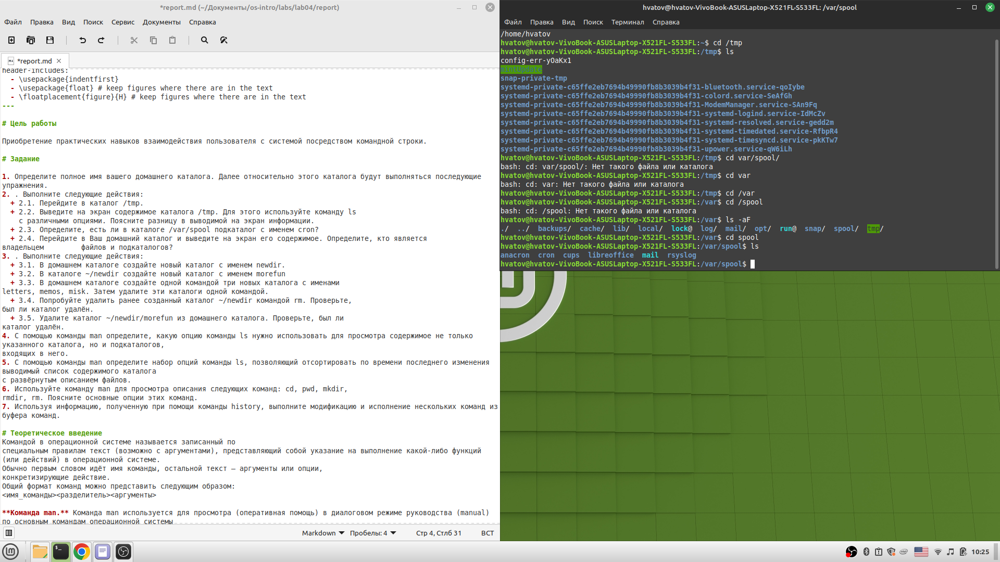
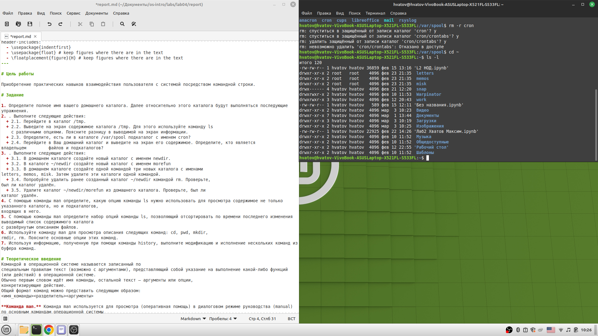
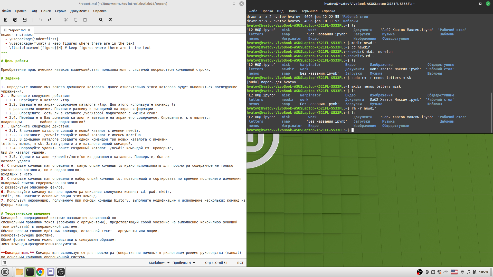
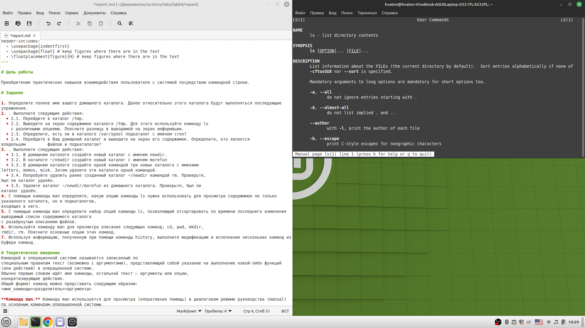
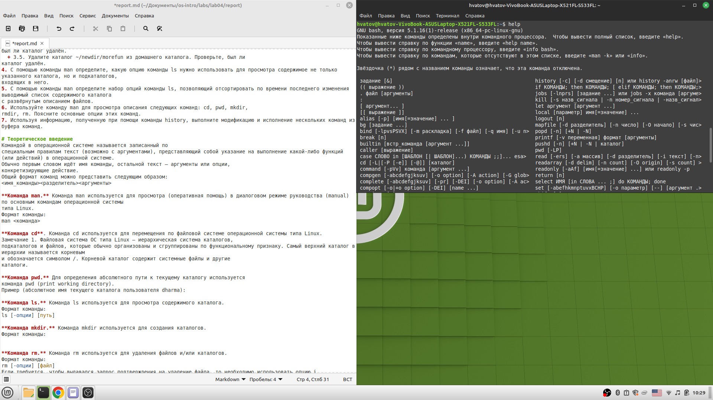

---
## Front matter
title: "Отчет по лабораторной работе"
subtitle: "Лабораторная работа"
author: "Максим Григорьевич Хватов"

## Generic otions
lang: ru-RU
toc-title: "Содержание"

## Bibliography
bibliography: bib/cite.bib
csl: pandoc/csl/gost-r-7-0-5-2008-numeric.csl

## Pdf output format
toc: true # Table of contents
toc-depth: 2
lof: true # List of figures
lot: true # List of tables
fontsize: 12pt
linestretch: 1.5
papersize: a4
documentclass: scrreprt
## I18n polyglossia
polyglossia-lang:
  name: russian
  options:
	- spelling=modern
	- babelshorthands=true
polyglossia-otherlangs:
  name: english
## I18n babel
babel-lang: russian
babel-otherlangs: english
## Fonts
mainfont: PT Serif
romanfont: PT Serif
sansfont: PT Sans
monofont: PT Mono
mainfontoptions: Ligatures=TeX
romanfontoptions: Ligatures=TeX
sansfontoptions: Ligatures=TeX,Scale=MatchLowercase
monofontoptions: Scale=MatchLowercase,Scale=0.9
## Biblatex
biblatex: true
biblio-style: "gost-numeric"
biblatexoptions:
  - parentracker=true
  - backend=biber
  - hyperref=auto
  - language=auto
  - autolang=other*
  - citestyle=gost-numeric
## Pandoc-crossref LaTeX customization
figureTitle: "Рис."
tableTitle: "Таблица"
listingTitle: "Листинг"
lofTitle: "Список иллюстраций"
lotTitle: "Список таблиц"
lolTitle: "Листинги"
## Misc options
indent: true
header-includes:
  - \usepackage{indentfirst}
  - \usepackage{float} # keep figures where there are in the text
  - \floatplacement{figure}{H} # keep figures where there are in the text
---

# Цель работы

Приобретение практических навыков взаимодействия пользователя с системой посредством командной строки.

# Задание

1. Определите полное имя вашего домашнего каталога. Далее относительно этого каталога будут выполняться последующие упражнения.
2. . Выполните следующие действия:
  + 2.1. Перейдите в каталог /tmp.
  + 2.2. Выведите на экран содержимое каталога /tmp. Для этого используйте команду ls
    с различными опциями. Поясните разницу в выводимой на экран информации.
  + 2.3. Определите, есть ли в каталоге /var/spool подкаталог с именем cron?
  + 2.4. Перейдите в Ваш домашний каталог и выведите на экран его содержимое. Определите, кто является       владельцем         файлов и подкаталогов?
3. . Выполните следующие действия:
  + 3.1. В домашнем каталоге создайте новый каталог с именем newdir.
  + 3.2. В каталоге ~/newdir создайте новый каталог с именем morefun
  + 3.3. В домашнем каталоге создайте одной командой три новых каталога с именами
letters, memos, misk. Затем удалите эти каталоги одной командой.
  + 3.4. Попробуйте удалить ранее созданный каталог ~/newdir командой rm. Проверьте,
был ли каталог удалён.
  + 3.5. Удалите каталог ~/newdir/morefun из домашнего каталога. Проверьте, был ли
каталог удалён.
4. С помощью команды man определите, какую опцию команды ls нужно использовать для просмотра содержимое не только указанного каталога, но и подкаталогов,
входящих в него.
5. С помощью команды man определите набор опций команды ls, позволяющий отсортировать по времени последнего изменения выводимый список содержимого каталога
с развёрнутым описанием файлов.
6. Используйте команду man для просмотра описания следующих команд: cd, pwd, mkdir,
rmdir, rm. Поясните основные опции этих команд.
7. Используя информацию, полученную при помощи команды history, выполните модификацию и исполнение нескольких команд из буфера команд.

# Теоретическое введение
Командой в операционной системе называется записанный по
специальным правилам текст (возможно с аргументами), представляющий собой указание на выполнение какой-либо функций (или действий) в операционной системе.
Обычно первым словом идёт имя команды, остальной текст — аргументы или опции,
конкретизирующие действие.
Общий формат команд можно представить следующим образом:
<имя_команды><разделитель><аргументы>

**Команда man.** Команда man используется для просмотра (оперативная помощь) в диалоговом режиме руководства (manual) по основным командам операционной системы
типа Linux.
Формат команды:
man <команда>

**Команда cd**. Команда cd используется для перемещения по файловой системе операционной системы типа Linux.
Замечание 1. Файловая система ОС типа Linux — иерархическая система каталогов,
подкаталогов и файлов, которые обычно организованы и сгруппированы по функциональному признаку. Самый верхний каталог в иерархии называется корневым
и обозначается символом /. Корневой каталог содержит системные файлы и другие
каталоги.

**Команда pwd.** Для определения абсолютного пути к текущему каталогу используется
команда pwd (print working directory).
Пример (абсолютное имя текущего каталога пользователя dharma):

**Команда ls.** Команда ls используется для просмотра содержимого каталога.
Формат команды:
ls [-опции] [путь]

**Команда mkdir.** Команда mkdir используется для создания каталогов.
Формат команды:

**Команда rm.** Команда rm используется для удаления файлов и/или каталогов.
Формат команды:
rm [-опции] [файл]
Если требуется, чтобы выдавался запрос подтверждения на удаление файла, то необходимо использовать опцию i.
Чтобы удалить каталог, содержащий файлы, нужно использовать опцию r. Без указания
этой опции команда не будет выполняться.

**Команда history.** Для вывода на экран списка ранее выполненных команд используется команда history. Выводимые на экран команды в списке нумеруются. К любой
команде из выведенного на экран списка можно обратиться по её номеру в списке,
воспользовавшись конструкцией !<номер_команды>.

# Выполнение лабораторной работы

* Перехзодим в домашний каталог с помощью `cd ~`

* Перееходим в каталог tmp и проверяем его с помощью команды `ls`

* Проверяем каталог var/spool на наличие каталога cron и убеждаемся,что его нет.
* Создаем в домашнем каталоге каталоги letters, memos, misk прр помощи команды `sudo mkdir letters memos misk`
* Удаляем раннее созданный каталог newdir командой `sudo rm -r newdir`

* Вызываем информацию по каждой из команд в задании с помощью `man`

* Вызываем команду `help` для отображения всех возможных команд терминала

# Выводы

Я научился работать с терминалом линукса, а конкретнее с командами, позволяющими взаимодействовать с каталогами файловой системы.

# Ответы на контрольные вопросы
1. Командная строка (консоль или Терминал) – это специальная программа, которая позволяет управлять компьютером путем ввода текстовых команд с клавиатуры.
2. При помощи команды pwd
3. При помощи команды ls -l
4. При помощи команды ls -a
5. rm -r удаление каталога; rm удаление файла
6. Используя команду history
7. 
8. mkdir newdir/ cd newdir
9. Символы экоанирования нужны для возможности отображения специальных симоволов, которые могут быть использованы в коде или в виде команд терминала, и я вляются служебными.
10. Выводятся права доступа, пользователи, владеющие директориями и файлами, дата изменеий и типы файлов
11. Относительный путь - это путь, который идёт от папки, в которой мы находимся, а абсолютный путь идёт от домашнего каталога.
12. Используя команду man *имя интересующей команды*
13. Клавиша tab

