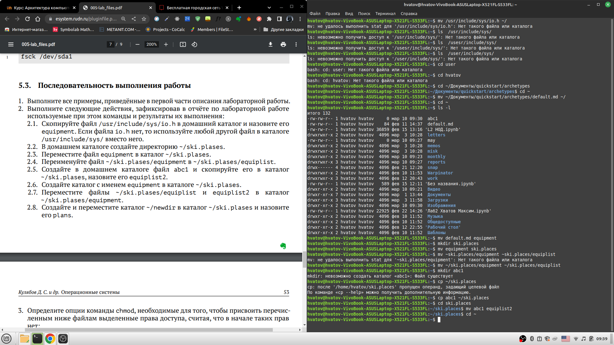

---
## Front matter
title: "Отчёт по лабораторной работе"
subtitle: "Лабораторная работа №5"
author: "Хватов Максим"

## Generic otions
lang: ru-RU
toc-title: "Содержание"

## Bibliography
bibliography: bib/cite.bib
csl: pandoc/csl/gost-r-7-0-5-2008-numeric.csl

## Pdf output format
toc: true # Table of contents
toc-depth: 2
lof: true # List of figures
lot: true # List of tables
fontsize: 12pt
linestretch: 1.5
papersize: a4
documentclass: scrreprt
## I18n polyglossia
polyglossia-lang:
  name: russian
  options:
	- spelling=modern
	- babelshorthands=true
polyglossia-otherlangs:
  name: english
## I18n babel
babel-lang: russian
babel-otherlangs: english
## Fonts
mainfont: PT Serif
romanfont: PT Serif
sansfont: PT Sans
monofont: PT Mono
mainfontoptions: Ligatures=TeX
romanfontoptions: Ligatures=TeX
sansfontoptions: Ligatures=TeX,Scale=MatchLowercase
monofontoptions: Scale=MatchLowercase,Scale=0.9
## Biblatex
biblatex: true
biblio-style: "gost-numeric"
biblatexoptions:
  - parentracker=true
  - backend=biber
  - hyperref=auto
  - language=auto
  - autolang=other*
  - citestyle=gost-numeric
## Pandoc-crossref LaTeX customization
figureTitle: "Рис."
tableTitle: "Таблица"
listingTitle: "Листинг"
lofTitle: "Список иллюстраций"
lotTitle: "Список таблиц"
lolTitle: "Листинги"
## Misc options
indent: true
header-includes:
  - \usepackage{indentfirst}
  - \usepackage{float} # keep figures where there are in the text
  - \floatplacement{figure}{H} # keep figures where there are in the text
---

# Цель работы

Ознакомление с файловой системой Linux, её структурой, именами и содержанием
каталогов. Приобретение практических навыков по применению команд для работы
с файлами и каталогами, по управлению процессами (и работами), по проверке использования диска и обслуживанию файловой системы.

# Задание

1. Выполните все примеры, приведённые в первой части описания лабораторной работы.
2. Выполните следующие действия, зафиксировав в отчёте по лабораторной работе
используемые при этом команды и результаты их выполнения:
    2.1. Скопируйте файл `/usr/include/sys/io.h` в домашний каталог и назовите его
    equipment. Если файла io.h нет, то используйте любой другой файл в каталоге
    `/usr/include/sys/ `вместо него.
    2.2. В домашнем каталоге создайте директорию `~/ski.plases.`
    2.3. Переместите файл equipment в каталог `~/ski.plases.`
    2.4. Переименуйте файл `~/ski.plases/equipment` в `~/ski.plases/equiplist.`
    2.5. Создайте в домашнем каталоге файл abc1 и скопируйте его в каталог
   ` ~/ski.plases,` назовите его `quiplist2.`
    2.6. Создайте каталог с именем equipment в каталоге `~/ski.plases.`
    2.7. Переместите файлы `~/ski.plases/equiplist` и `equiplist2` в каталог
    ~/ski.plases/equipment.
    2.8. Создайте и переместите каталог `~/newdir` в каталог `/ski.plases` и назовите
    его plans.

3. Определите опции команды chmod, необходимые для того, чтобы присвоить перечисленным ниже файлам выделенные права доступа, считая, что в начале таких прав
нет:
    3.1. `drwxr--r--` ... australia
    3.2. `drwx--x--x`... play
    3.3. `-r-xr--r--` ... my_os
    3.4. `-rw-rw-r--` ... feathers
При необходимости создайте нужные файлы.

4. Проделайте приведённые ниже упражнения, записывая в отчёт по лабораторной
работе используемые при этом команды:
    4.1. Просмотрите содержимое файла `/etc/password.`
    4.2. Скопируйте файл `~/feathers` в файл `~/file.old.`
    4.3. Переместите файл `~/file.old `в каталог` ~/play.`
    4.4. Скопируйте каталог `~/play` в каталог `~/fun.`
    4.5. Переместите каталог `~/fun `в каталог `~/play` и назовите его` games`.
    4.6. Лишите владельца файла `~/feathers` права на чтение.
    4.7. Что произойдёт, если вы попытаетесь просмотреть файл `~/feathers` командой
    cat?
    4.8. Что произойдёт, если вы попытаетесь скопировать файл `~/feathers?`
    4.9. Дайте владельцу файла `~/feathers` право на чтение.
    4.10. Лишите владельца каталога `~/play`права на выполнение.
    4.11. Перейдите в каталог `~/play. `Что произошло?
    4.12. Дайте владельцу каталога `~/play` право на выполнение.

5. Прочитайте man по командам mount, fsck, mkfs, kill и кратко их охарактеризуйте,
приведя примеры.

# Теоретическое введение

Сущестуют команды для работы с файлами и кталогами: touch(создание файла), cat(просмотр содержимого файла), less(просмотр файла постранично), head(вывод первых 10 строк файла), tail(вывод последних 10 строк файла).

Команды копирования файлолв и каталогов `cp` *исходный* *целевой*
Команды перемещения и переименования файлов и каталогов `mv` *старый* *новый*. Также эти команды можно использовать для работы с нетекущими каталогами.

Клманды прав доступа позволяют устанавливать права доступа для владельца, группы, и всех остальных.
Изменяются права доступа с помощью команды `chmod [опции] файл/каталог`

# Выполнение лабораторной работы

1. Выполняем все примеры по ТЗ в начале лабораторной работы, все команды прописаны в файле Лабораторной №5.
Результаты выполнения примеров:

{#fig:001 width=70%}
{#fig:001 width=70%}
{#fig:001 width=70%}

2. Выполняем команды 
`mv default.md equipment`-> `mkdir ski.places/equipment ~/ski.places/equiplist` -> `cp ~/abc1 ~/ski.places`-> `cd ski.places` -> `mv abc1 equiplist2`. Здесь п=мы создаём и перемещаем файлы и каталоги с названиями из ТЗ.

{#fig:001 width=70%}
{#fig:001 width=70%}

3. Даём и забираем права у файлов и каталогов, используя модификаторы u+r, u-r(даём и забьираем право на чтение), u-x(забираем право на выполнение), u+x(даём право на выполнение). Если мы забираем право на выполнение, то не можем как-то взаитмодействовать с файлами или каталогами, которых  мы забрали это право. Когда забираем право на чтение, то мы не можем открывать файлы или каталоги.
 
{#fig:001 width=70%}

4. Выполняем манипуляции с файлами и каталогами как в ТЗ. Используем команды соответственно:
`sudo mkdir /etc/passwod` - создание каталога password
`sudo touch /etc/password/password` - созданеи файла password
`cat password` - просмотр содержимого файла password
`mv ~/feathers ~/file.old` - переименования файла feathers в file.old
`mv ~/file.old ~/play` - переименование файла file.old в play
`mkdir ~/fun` - создание каталога fun
`mv ~/play ~/fun` - переименование каталога play в fun
`mv ~/fun ~/play` - переименование наоборот

{#fig:001 width=70%}

# Выводы

Я ознакомился с файловой системой линукс, её структурой, именами и содержанием каталогов. Научился работать с командами для манипуляции файлами и каталогами.

# Список литературы{.unnumbered}

::: {#refs}
:::
