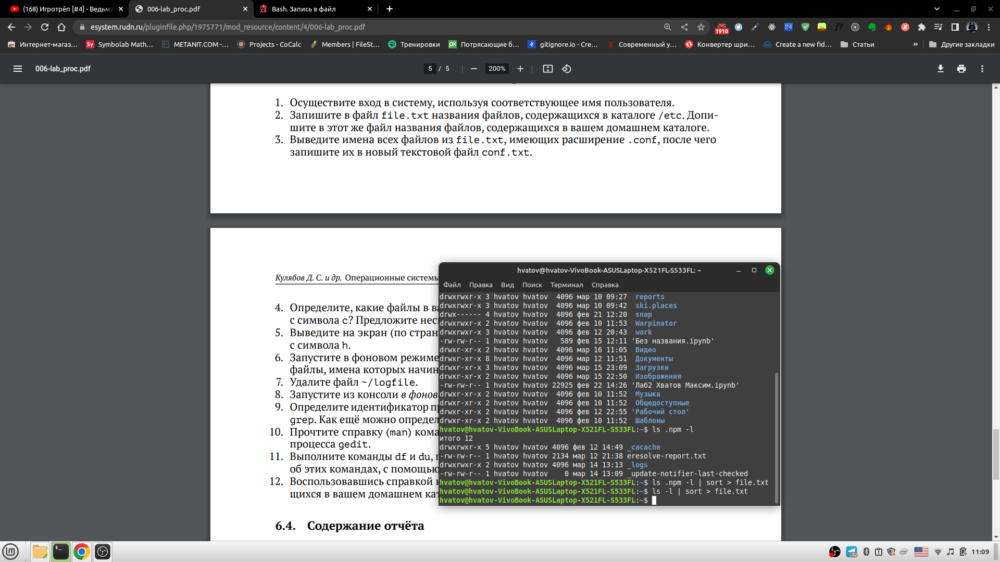
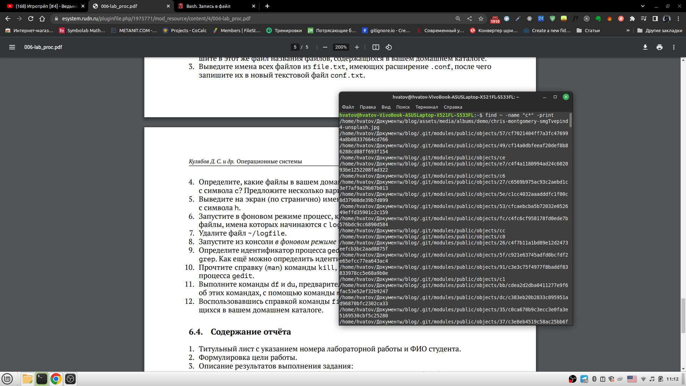
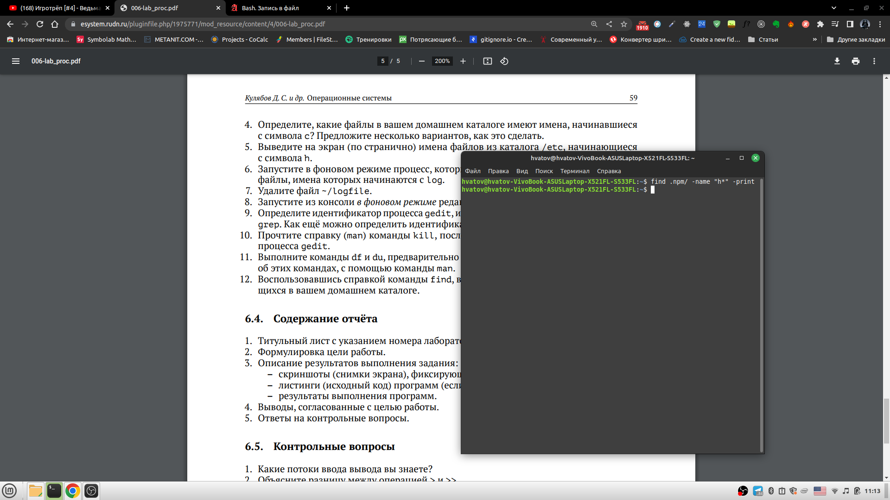
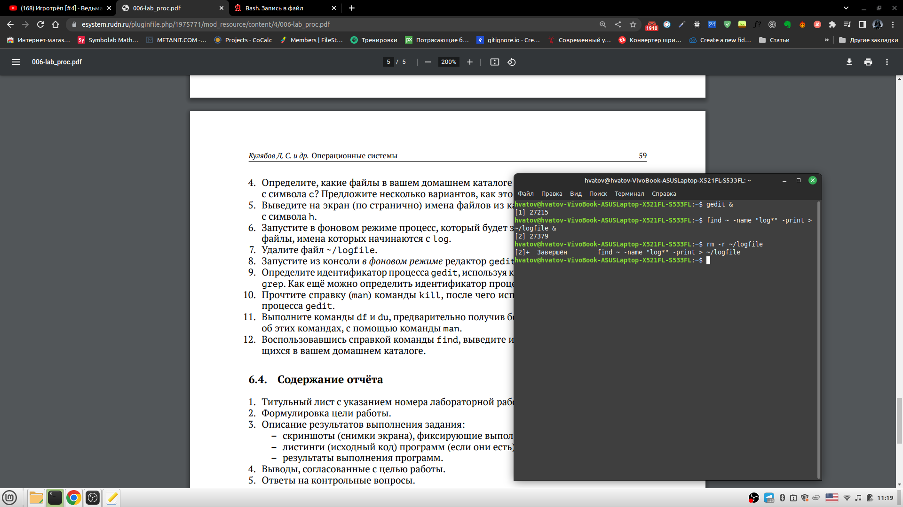
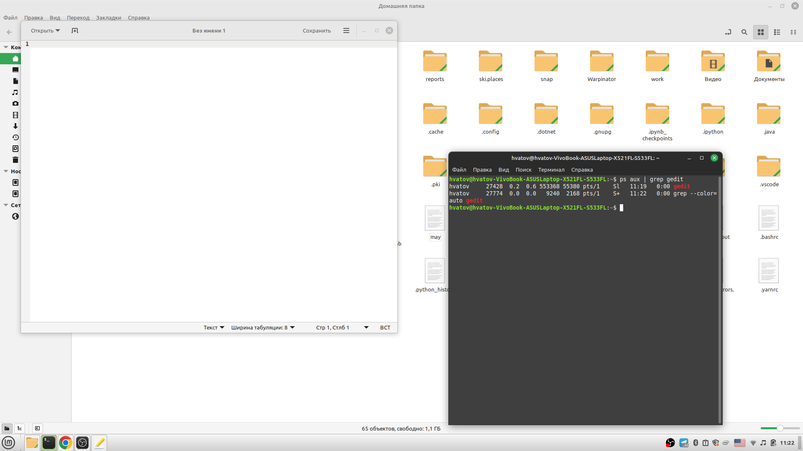
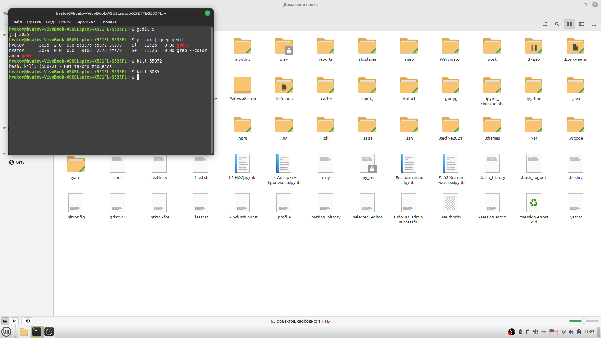
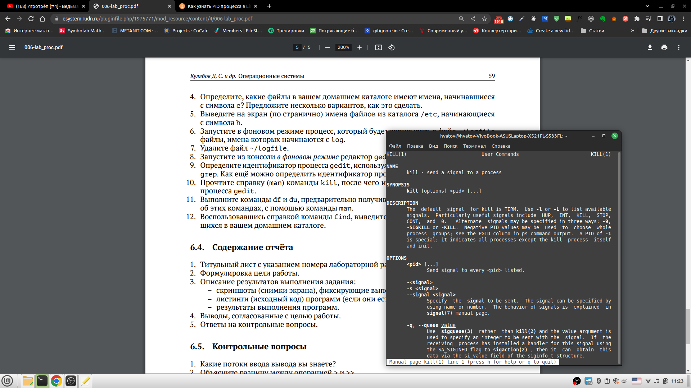
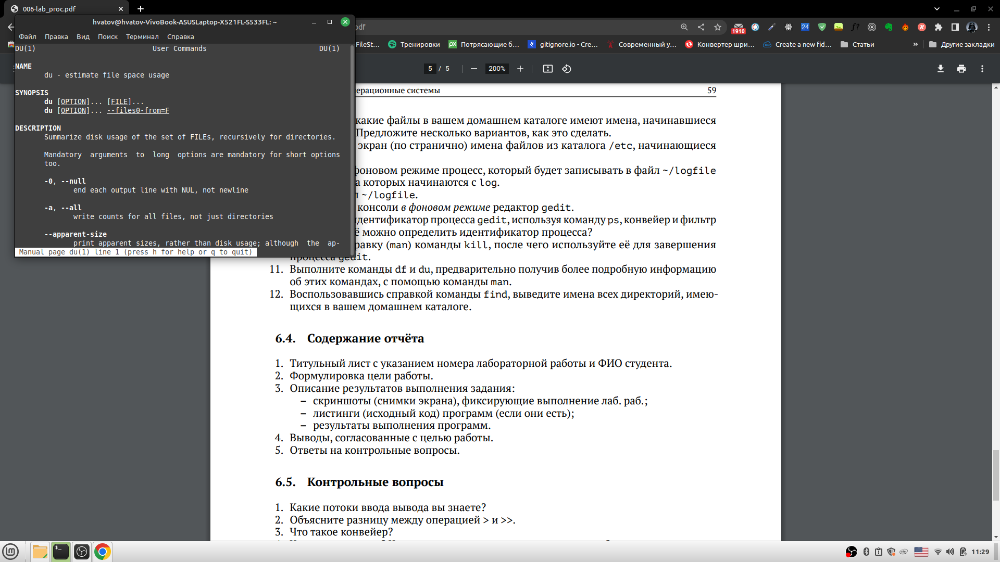
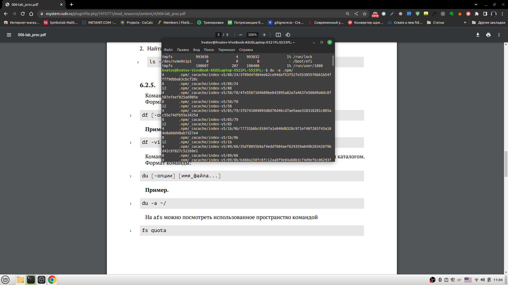
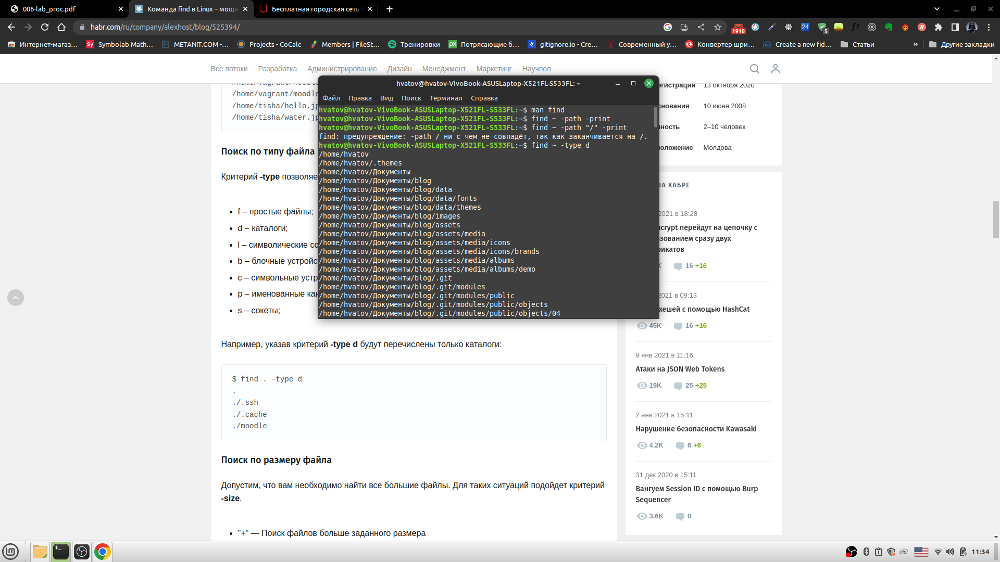

---
## Front matter
title: "Отчёт по лабораторной работе"
subtitle: "Лабораторная работа №6"
author: "Хватов Максим"

## Generic otions
lang: ru-RU
toc-title: "Содержание"

## Bibliography
bibliography: bib/cite.bib
csl: pandoc/csl/gost-r-7-0-5-2008-numeric.csl

## Pdf output format
toc: true # Table of contents
toc-depth: 2
lof: true # List of figures
lot: true # List of tables
fontsize: 12pt
linestretch: 1.5
papersize: a4
documentclass: scrreprt
## I18n polyglossia
polyglossia-lang:
  name: russian
  options:
	- spelling=modern
	- babelshorthands=true
polyglossia-otherlangs:
  name: english
## I18n babel
babel-lang: russian
babel-otherlangs: english
## Fonts
mainfont: PT Serif
romanfont: PT Serif
sansfont: PT Sans
monofont: PT Mono
mainfontoptions: Ligatures=TeX
romanfontoptions: Ligatures=TeX
sansfontoptions: Ligatures=TeX,Scale=MatchLowercase
monofontoptions: Scale=MatchLowercase,Scale=0.9
## Biblatex
biblatex: true
biblio-style: "gost-numeric"
biblatexoptions:
  - parentracker=true
  - backend=biber
  - hyperref=auto
  - language=auto
  - autolang=other*
  - citestyle=gost-numeric
## Pandoc-crossref LaTeX customization
figureTitle: "Рис."
tableTitle: "Таблица"
listingTitle: "Листинг"
lofTitle: "Список иллюстраций"
lotTitle: "Список таблиц"
lolTitle: "Листинги"
## Misc options
indent: true
header-includes:
  - \usepackage{indentfirst}
  - \usepackage{float} # keep figures where there are in the text
  - \floatplacement{figure}{H} # keep figures where there are in the text
---

# Цель работы

Ознакомление с инструментами поиска файлов и фильтрации текстовых данных.
Приобретение практических навыков: по управлению процессами (и заданиями), по
проверке использования диска и обслуживанию файловых систем.

# Задание

1. Осуществите вход в систему, используя соответствующее имя пользователя.
2. Запишите в файл file.txt названия файлов, содержащихся в каталоге /etc. Допишите в этот же файл названия файлов, содержащихся в вашем домашнем каталоге.
3. Выведите имена всех файлов из file.txt, имеющих расширение .conf, после чего
запишите их в новый текстовой файл conf.txt.
Кулябов Д. С. и др. Операционные системы 59
4. Определите, какие файлы в вашем домашнем каталоге имеют имена, начинавшиеся
с символа c? Предложите несколько вариантов, как это сделать.
5. Выведите на экран (по странично) имена файлов из каталога /etc, начинающиеся
с символа h.
6. Запустите в фоновом режиме процесс, который будет записывать в файл ~/logfile
файлы, имена которых начинаются с log.
7. Удалите файл ~/logfile.
8. Запустите из консоли в фоновом режиме редактор gedit.
9. Определите идентификатор процесса gedit, используя команду ps, конвейер и фильтр
grep. Как ещё можно определить идентификатор процесса?
10. Прочтите справку (man) команды kill, после чего используйте её для завершения
процесса gedit.
11. Выполните команды df и du, предварительно получив более подробную информацию
об этих командах, с помощью команды man.
12. Воспользовавшись справкой команды find, выведите имена всех директорий, имеющихся в вашем домашнем каталоге.

# Теоретическое введение

## Перенаправление ввода-вывода

В системе по умолчанию открыто три специальных потока:
– stdin — стандартный поток ввода (по умолчанию: клавиатура), файловый дескриптор
0;
– stdout — стандартный поток вывода (по умолчанию: консоль), файловый дескриптор
1;
– stderr — стандартный поток вывод сообщений об ошибках (по умолчанию: консоль),
файловый дескриптор 2.
Большинство используемых в консоли команд и программ записывают результаты
своей работы в стандартный поток вывода stdout. Например, команда ls выводит в стандартный поток вывода (консоль) список файлов в текущей директории. Потоки вывода
и ввода можно перенаправлять на другие файлы или устройства. Проще всего это делается
с помощью символов >, >>, <, <<.

## Конвейер

Конвейер (pipe) служит для объединения простых команд или утилит в цепочки, в которых результат работы предыдущей команды передаётся последующей. Синтаксис
следующий:

`команда 1 | команда 2`
означает, что вывод команды 1 передастся на ввод команде 2

## Поиск файлов

Команда find используется для поиска и отображения на экран имён файлов, соответствующих заданной строке символов.
Формат команды:
`find путь [-опции]`

## Фильтрация текста

Найти в текстовом файле указанную строку символов позволяет команда grep.
Формат команды:
`grep строка имя_файла`

##  Проверка использования диска

Команда df показывает размер каждого смонтированного раздела диска.
Формат команды:
`df [-опции] [файловая_система]`

## Управление задачами

Любую выполняющуюся в консоли команду или внешнюю программу можно запустить
в фоновом режиме. Для этого следует в конце имени команды указать знак амперсанда
&. Например:
`gedit &`
Будет запущен текстовой редактор gedit в фоновом режиме. Консоль при этом не будет
заблокирована.
Запущенные фоном программы называются задачами (jobs). Ими можно управлять
с помощью команды jobs, которая выводит список запущенных в данный момент задач.
Для завершения задачи необходимо выполнить команду
`kill %номер задачи`

## Управление процессами

Любой команде, выполняемой в системе, присваивается идентификатор процесса
(process ID). Получить информацию о процессе и управлять им, пользуясь идентификатором процесса, можно из любого окна командного интерпретатора.

## Получение информации о процессах

Команда ps используется для получения информации о процессах.
Формат команды:
`ps [-опции]`
Для получения информации о процессах, управляемых вами и запущенных (работающих или остановленных) на вашем терминале, используйте опцию aux.
Пример:
`ps aux`

# Выполнение лабораторной работы

1. В систему зашёл.
2. Использую команду ls -l .npm | sort > file.txt
{#fig:001 width=70%}
3. Таких файлов у меня в каталоге нет
4. Ищем файлы и выводим их, начинающиеся с символа "с" с помощью команды find ~ -name "c*" -print
{#fig:001 width=70%}
5. Ищем файлы в каталоге .npm/ и выводим их с помощью команды find .npm "h*" -print. Ищем файлы, которые начинаются с символа h
{#fig:001 width=70%}
6. Используем команду find ~ -name "log*" -print > /logfile &
{#fig:001 width=70%}
7. Используем команду rm /logfile
8. Используем команду gedit & , предварительно скачав её.
9. Определяем идентификатор процесса gedit  с помощью команды ps aux | grep gedit
{#fig:001 width=70%}
10. Используем команду kill [номер процесса], чтобы завершить выполнние gedit. Предварительно изучим команду с помощью man
{#fig:001 width=70%}
{#fig:001 width=70%}
11. Выводим информацию о командах df и du  с помощью man
{#fig:001 width=70%}
{#fig:001 width=70%}
И посмотрим каталоги в директории .npm с помощью команды du -a .npm
{#fig:001 width=70%}
12. Найдём названия всех каталогов в домашнем каталоге с помощью команды find ~ -type d
{#fig:001 width=70%}

# Выводы

Я ознакомился с командами и сеистемами поиска и фильтрации файлов и каталогов. Научился управлять процессами и заданиями по проверке и использованию мпеста на файловой системе и дисках.

#Ответы на контрольные вопросы

1. Байтовы и символьные
2. `>`: Перезаписывает существующий файл или создает файл, если файл с указанным именем       отсутствует в каталоге.
`>>` : добавляет существующий файл или создает файл, если файл с указанным именем отсутствует в каталоге.
3. Система в которой результаты вывода попадают в поток результатов ввода
4. Компьютерная программа сама по себе — лишь пассивная последовательность инструкций. В то время как процесс — непосредственное выполнение этих инструкций.
5. GID - идентификатор группы. PID - идентификатор процесса
6. Задачи - это процессы, которые выполняются и запущены одновременно, могут выполняться в фоновом режиме.
7. top показывает общее количество процессов, сколько запущено, сколько в спящем режиме.
htop позвоялет видеть всё то же самое, но еще и даёт возможномть прокручивать вертикально и горизонтально все процессы.
8. Используется команда find [путь] -[опции]
`find ~ "*.f" -print` - ищем все файлы с расширением f и выводим в консоль
9. С помощью команды grep
10. С помощью команды df -h
11. С помощью команды du ~
12. С помощью команды kill [номер процесса]

# Список литературы{.unnumbered}

::: {#refs}
:::
