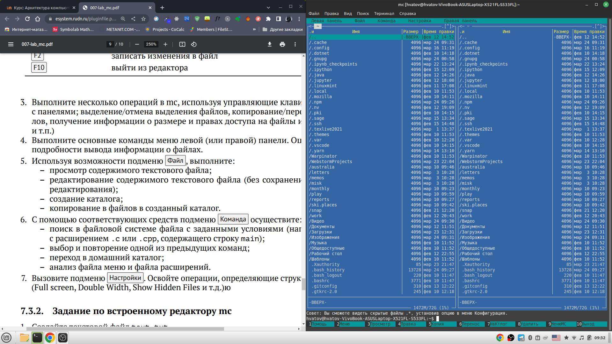

---
## Front matter
title: "Отчёт по лабораторной работе"
subtitle: "Лабораторная работа №7"
author: "Хватов Максим"

## Generic otions
lang: ru-RU
toc-title: "Содержание"

## Bibliography
bibliography: bib/cite.bib
csl: pandoc/csl/gost-r-7-0-5-2008-numeric.csl

## Pdf output format
toc: true # Table of contents
toc-depth: 2
lof: true # List of figures
lot: true # List of tables
fontsize: 12pt
linestretch: 1.5
papersize: a4
documentclass: scrreprt
## I18n polyglossia
polyglossia-lang:
  name: russian
  options:
	- spelling=modern
	- babelshorthands=true
polyglossia-otherlangs:
  name: english
## I18n babel
babel-lang: russian
babel-otherlangs: english
## Fonts
mainfont: PT Serif
romanfont: PT Serif
sansfont: PT Sans
monofont: PT Mono
mainfontoptions: Ligatures=TeX
romanfontoptions: Ligatures=TeX
sansfontoptions: Ligatures=TeX,Scale=MatchLowercase
monofontoptions: Scale=MatchLowercase,Scale=0.9
## Biblatex
biblatex: true
biblio-style: "gost-numeric"
biblatexoptions:
  - parentracker=true
  - backend=biber
  - hyperref=auto
  - language=auto
  - autolang=other*
  - citestyle=gost-numeric
## Pandoc-crossref LaTeX customization
figureTitle: "Рис."
tableTitle: "Таблица"
listingTitle: "Листинг"
lofTitle: "Список иллюстраций"
lotTitle: "Список таблиц"
lolTitle: "Листинги"
## Misc options
indent: true
header-includes:
  - \usepackage{indentfirst}
  - \usepackage{float} # keep figures where there are in the text
  - \floatplacement{figure}{H} # keep figures where there are in the text
---

# Цель работы

Освоение основных возможностей командной оболочки Midnight Commander. Приобретение навыков практической работы по просмотру каталогов и файлов; манипуляций
с ними.

# Задание
## Часть 1
1. Изучите информацию о mc, вызвав в командной строке man mc.
2. Запустите из командной строки mc, изучите его структуру и меню.
3. Выполните несколько операций в mc, используя управляющие клавиши (операции
с панелями; выделение/отмена выделения файлов, копирование/перемещение файлов, получение информации о размере и правах доступа на файлы и/или каталоги
и т.п.)
4. Выполните основные команды меню левой (или правой) панели. Оцените степень
подробности вывода информации о файлах.
5. Используя возможности подменю Файл , выполните:
– просмотр содержимого текстового файла;
– редактирование содержимого текстового файла (без сохранения результатов
редактирования);
– создание каталога;
– копирование в файлов в созданный каталог.
6. С помощью соответствующих средств подменю Команда осуществите:
– поиск в файловой системе файла с заданными условиями (например, файла
с расширением .c или .cpp, содержащего строку main);
– выбор и повторение одной из предыдущих команд;
– переход в домашний каталог;
– анализ файла меню и файла расширений.
7. Вызовите подменю Настройки . Освойте операции, определяющие структуру экрана mc
(Full screen, Double Width, Show Hidden Files и т.д.)

## Часть 2

1. Создайте текстовой файл text.txt.
2. Откройте этот файл с помощью встроенного в mc редактора.
3. Вставьте в открытый файл небольшой фрагмент текста, скопированный из любого
другого файла или Интернета.
4. Проделайте с текстом следующие манипуляции, используя горячие клавиши:
4.1. Удалите строку текста.
4.2. Выделите фрагмент текста и скопируйте его на новую строку.
4.3. Выделите фрагмент текста и перенесите его на новую строку.
4.4. Сохраните файл.
4.5. Отмените последнее действие.
4.6. Перейдите в конец файла (нажав комбинацию клавиш) и напишите некоторый
текст.
4.7. Перейдите в начало файла (нажав комбинацию клавиш) и напишите некоторый
текст.
4.8. Сохраните и закройте файл.
5. Откройте файл с исходным текстом на некотором языке программирования (например C или Java)
6. Используя меню редактора, включите подсветку синтаксиса, если она не включена,
или выключите, если она включена

# Теоретическое введение

Командная оболочка — интерфейс взаимодействия пользователя с операционной системой и программным обеспечением посредством команд.
Midnight Commander (или mc) — псевдографическая командная оболочка для UNIX/Linux
систем. Для запуска mc необходимо в командной строке набрать mc и нажать Enter .
Рабочее пространство mc имеет две панели, отображающие по умолчанию списки
файлов двух каталогов
Над панелями располагается меню, доступ к которому осуществляется с помощью
клавиши F9 . Под панелями внизу расположены управляющие экранные кнопки, ассоциированные с функциональными клавишами F1 – F10. Над ними располагается
командная строка, предназначенная для ввода команд.
Панель в mc отображает список файлов текущего каталога. Абсолютный путь к этому
каталогу отображается в заголовке панели. У активной панели заголовок и одна из её
строк подсвечиваются. Управление панелями осуществляется с помощью определённых
комбинаций клавиш или пунктов меню mc.
Панели можно поменять местами. Для этого и используется комбинация клавиш Ctrl-u
или команда меню mc Переставить панели . Также можно временно убрать отображение
панелей (отключить их) с помощью комбинации клавиш Ctrl-o или команды меню mc
Отключить панели . Это может быть полезно, например, если необходимо увидеть вывод
какой-то информации на экран после выполнения какой-либо команды shell.
С помощью последовательного применения комбинации клавиш Ctrl-x d есть
возможность сравнения каталогов, отображённых на двух панелях. Панели могут дополнительно быть переведены в один из двух режимов: Информация или Дерево . В режиме
Информация на панель выводятся сведения о файле и текущей файловой системе,
расположенных на активной панели. В режиме Дерево (рис. 7.3) на одной из панелей
выводится структура дерева каталогов.
Управлять режимами отображения панелей можно через пункты меню mc Правая панель
и Левая панель

# Выполнение лабораторной работы

Сначала посмотрим информацию о редакторе mc с помощью команды `man mc`
{#fig:001 width=70%}

Дальше запускаем редактор mc с помощью команды `mc`
{#fig:001 width=70%}

Узнаём права у конкретного файла с помощью меню Файл и соответсвующей команды в этом меню
{#fig:001 width=70%}

Редактируем содержимое файла file.txt с помощью меню Файл и команды Правка
{#fig:001 width=70%}

Переносим файл file.txt в /catalog с помошью команды Перемещения в mc , указывая путь к /catalog
{#fig:001 width=70%}

Ищем файлы с расширением cpp в меню Команда и вбиваем в строку поиска шаблон *.cpp
{#fig:001 width=70%}

Пробуем изменить внешний вид рпедактора с вертикального на горизонтальный, также можно переключить тему на темную или на другую с помощью меню Настройки
{#fig:001 width=70%}

Дальше редактируем содерживое файла abc1
{#fig:001 width=70%}

Включение подсветки синтаксиса в файле JavaScript не удалось, потому что, как я думаю, нет нужного файла, где заданы настройки переалючения синтаксиса, в то время, как для других языков эти файлы есть.

# Выводы

Я освоил возможности командной оболочки Modnight Commander и  приобрёл навыки практической работы по просмотру каталогов и файлов, а также научился ими манипулировать.

# Ответы на контрольные вопросы

1. Full(отображается имя файла, размер файла и время последней модификации.), Brief(список файлов располагается в две колонки и состоит только из имён файлов ), Long(идентичен результату выполнения команды ls -l), User(пользовательское отображение)
2. Созание файла или каталога, копирование, просмотр, правка, удаление
3. Слева находятся файлы текущего каталога, с ними можно выполнять любые действия, для которых есть команды mc(копирование, редактирование,Ю удаление, просмотр)
4. Просмотр(для просмотра содержимого файла), Правка(для редактирования файла), копирование(для копирования файла), права доступа(для установленич прав доступа), переименование, удаление, выход
5. В меню Команда можно переставлять, сравнивать каталоги, отключать и включать различные панели, просматривать истории изменения файлов и каталогов, восстанавливать файлы, также можно настроить и отредактировать файлы меню под себя
6. Можно настроить внешний вид и конфигурацию, а также оформление в меню настройки
7. Все команды уже описаны в вопросах выше
8. Все команды уже описаны в вопросах выше
9.  Меню пользователя – это меню, состоящее из команд, определенных пользователем. При вызове меню используется файл ~/.mc.menu. Если такого файла нет, то по умолчанию используется системный файл меню /usr/lib/mc/mc.menu.

Формат этого файла достаточно прост. Строки, не начинающиеся с пробела или табуляции, являются записями меню (для того чтобы у записи была горячая клавиша, нужно, чтобы строка начиналась с буквы). Все строки, начинающиеся с пробела или табуляции, являются командами, которые выполняются при выборе записи.

При выборе записи все строки, принадлежащие ей, копируются в файл во временном каталоге (обычно это /usr/tmp), а затем этот файл выполняется. Это позволяет использовать стандартные конструкции, состоящие из команд оболочки. Перед выполнением файла MC производит несложные макроподстановки:

%f имя текущего файла.

%d имя текущего каталога.

%F имя текущего файла в неактивной панели.

%D имя текущего каталога неактивной панели.

%t помеченные файлы.

%T помеченные файлы из неактивной панели.

10. Все команды по работе внутри файла идентичны тем, которые работают и над самим файлом или каталогами

# Список литературы{.unnumbered}

::: {#refs}
:::
