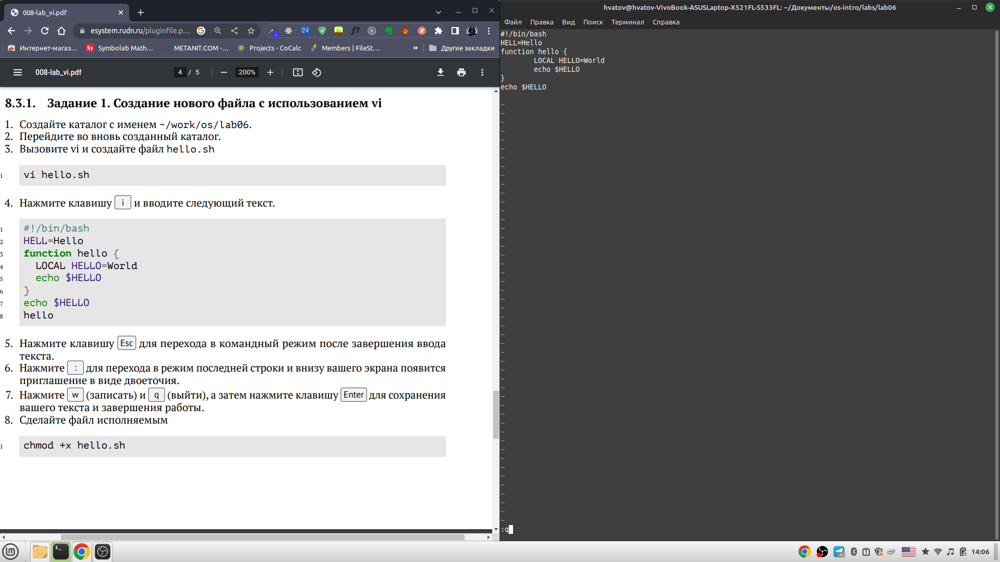
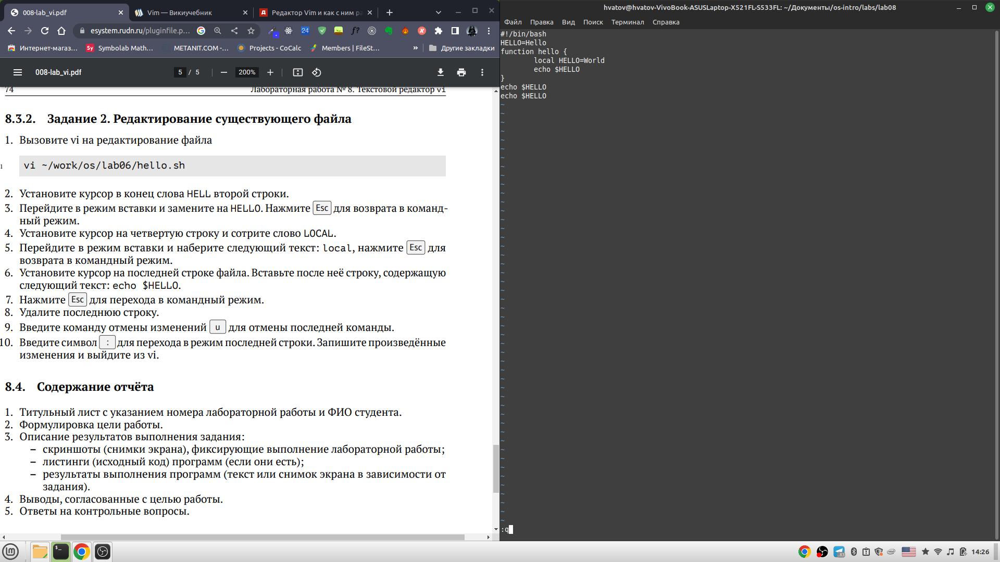

---
## Front matter
title: "Отчёт по лабораторной работе"
subtitle: "Лабораторная работа №8"
author: "Хватов Максим Григорьевич"

## Generic otions
lang: ru-RU
toc-title: "Содержание"

## Bibliography
bibliography: bib/cite.bib
csl: pandoc/csl/gost-r-7-0-5-2008-numeric.csl

## Pdf output format
toc: true # Table of contents
toc-depth: 2
lof: true # List of figures
lot: true # List of tables
fontsize: 12pt
linestretch: 1.5
papersize: a4
documentclass: scrreprt
## I18n polyglossia
polyglossia-lang:
  name: russian
  options:
	- spelling=modern
	- babelshorthands=true
polyglossia-otherlangs:
  name: english
## I18n babel
babel-lang: russian
babel-otherlangs: english
## Fonts
mainfont: PT Serif
romanfont: PT Serif
sansfont: PT Sans
monofont: PT Mono
mainfontoptions: Ligatures=TeX
romanfontoptions: Ligatures=TeX
sansfontoptions: Ligatures=TeX,Scale=MatchLowercase
monofontoptions: Scale=MatchLowercase,Scale=0.9
## Biblatex
biblatex: true
biblio-style: "gost-numeric"
biblatexoptions:
  - parentracker=true
  - backend=biber
  - hyperref=auto
  - language=auto
  - autolang=other*
  - citestyle=gost-numeric
## Pandoc-crossref LaTeX customization
figureTitle: "Рис."
tableTitle: "Таблица"
listingTitle: "Листинг"
lofTitle: "Список иллюстраций"
lotTitle: "Список таблиц"
lolTitle: "Листинги"
## Misc options
indent: true
header-includes:
  - \usepackage{indentfirst}
  - \usepackage{float} # keep figures where there are in the text
  - \floatplacement{figure}{H} # keep figures where there are in the text
---

# Цель работы

Познакомиться с операционной системой Linux. Получить практические навыки работы с редактором vi, установленным по умолчанию практически во всех дистрибутивах.

# Задание

## Задание 1. Создание нового файла с использованием vi

1. Создайте каталог с именем ~/work/os/lab06.
2. Перейдите во вновь созданный каталог.
3. Вызовите vi и создайте файл hello.sh
4. Набрать код из листинга
5. Нажмите клавишу Esc для перехода в командный режим после завершения ввода
текста.
6. Нажмите : для перехода в режим последней строки и внизу вашего экрана появится
приглашение в виде двоеточия.
7. Нажмите w (записать) и q (выйти), а затем нажмите клавишу Enter для сохранения
вашего текста и завершения работы.
8. Сделайте файл исполняемым

## Задание 2. Редактирование существующего файла

1. Вызовите vi на редактирование файла 
2. Установите курсор в конец слова HELL второй строки.
3. Перейдите в режим вставки и замените на HELLO. Нажмите Esc для возврата в командный режим.
4. Установите курсор на четвертую строку и сотрите слово LOCAL.
5. Перейдите в режим вставки и наберите следующий текст: local, нажмите Esc для
возврата в командный режим.
6. Установите курсор на последней строке файла. Вставьте после неё строку, содержащую
следующий текст: echo $HELLO.
7. Нажмите Esc для перехода в командный режим.
8. Удалите последнюю строку.
9. Введите команду отмены изменений u для отмены последней команды.
10. Введите символ : для перехода в режим последней строки. Запишите произведённые
изменения и выйдите из vi.

# Теоретическое введение

В большинстве дистрибутивов Linux в качестве текстового редактора по умолчанию
устанавливается интерактивный экранный редактор vi (Visual display editor).
Редактор vi имеет три режима работы:
– командный режим — предназначен для ввода команд редактирования и навигации по
редактируемому файлу;
– режим вставки — предназначен для ввода содержания редактируемого файла;
– режим последней (или командной) строки — используется для записи изменений в файл
и выхода из редактора.
Для вызова редактора vi необходимо указать команду vi и имя редактируемого файла:
vi <имя_файла>
При этом в случае отсутствия файла с указанным именем будет создан такой файл.
Переход в командный режим осуществляется нажатием клавиши Esc . Для выхода из
редактора vi необходимо перейти в режим последней строки: находясь в командном
режиме, нажать Shift-; (по сути символ : — двоеточие), затем:
– набрать символы wq, если перед выходом из редактора требуется записать изменения
в файл;
– набрать символ q (или q!), если требуется выйти из редактора без сохранения.
Замечание. Следует помнить, что vi различает прописные и строчные буквы при наборе
(восприятии) команд.

Все команды с объяснениями можно посмотреть на сайте https://jino.ru/journal/articles/proframmirovanie-v-vim/

# Выполнение работы

Зайдем в каталог с 8-ой лабораторной работой и создадим файл hello.sh.
Запустимм терминал и впишем команду vi hello.sh. 
Войдём в режим редактирования, нажав i
Введём код:
` #!/bin/bash
  HELL=Hello
  function hello {
       LOCAL HELLO=World
       echo $HELLO
}
  echo $HELLO

нажимаем клавишу Esc и переходим в командный режим. Нажимаем :wq и выходим в терминал, записав изменения в файл. Делаем файл исполняемым с помощью команды `chmod +x hello.sh `

{#fig:001 width=70%}

Снова вызываем редактор vim на том же файле и с помощью стрелок переходим к нужной строке. входим в режим редактирования с помощью клавиши i и изменяем HELL на HELLO.
Нажимаем ESc и возвращаемся в командный режим. Переходим к слову LOCAL и стераем его с помощью команды d5h, предварительно перейдя в режим редактирования. 
Переходим к последеней строке файла с помощью стрелок и пишем echo $HELLO
Возвращаемся в командный режим с помощью Esc и удаляем строку с помощью команды dd
Отменяем последнее действие с помощью команды u
Нажимаем клавишу : и переходим в режим последней строки, записываем изменения с помощью команды w,а q для выхода из редактора.

{#fig:001 width=70%}

# Выводы

Я получил практические навыки работы с редактором vim и более подробнее ознакомился с ОС Linux

# Отвпеты на контрольные вопросы

1. Режим командный - для выполнения команд внутри редактора
   Режим вставки - для работы с содержимым в тексте
2. Командой :q!
3. 0 - пререход в начало строки
   $ - переход в конец строки
   G - переход в конец файла
   nG - переход на строку с номером n
4. Последовательность символов в режиме вставки
5. С помощью команды :
6. Команды для удаления текста, вставка строки, вставка текста, копирование текста, замена текста из буффера
7. Ввести символ для вставки и выполнить команду nI, где n-кол-во символов для вставки
8.  С помощью команды u
9. 𝑛,𝑚 d — удалить строки с 𝑛 по 𝑚;
– : 𝑖,𝑗 m 𝑘 — переместить строки с 𝑖 по 𝑗, начиная со строки 𝑘;
– : 𝑖,𝑗 t 𝑘 — копировать строки с 𝑖 по 𝑗 в строку 𝑘;
– : 𝑖,𝑗 w имя-файла — записать строки с 𝑖 по 𝑗 в файл с именем имя-файла.
– : w — записать изменённый текст в файл, не выходя из vi;
– : w имя-файла — записать изменённый текст в новый файл с именем имя-файла;
– : w ! имя-файла — записать изменённый текст в файл с именем имя-файла;
– : w q — записать изменения в файл и выйти из vi;
– : q — выйти из редактора vi;
– : q ! — выйти из редактора без записи;
10. С помощью команды перехода в конец строки
11. Нужно войти в командный режим и набрать $vimtutor
12. При запуске vi мы находимся сразу в командном режиме, а дальше можно прееключать их с помощью клавиш
13. Я не понимаю, что имеется ввиду

# Список литературы{.unnumbered}

::: {#refs}
:::
