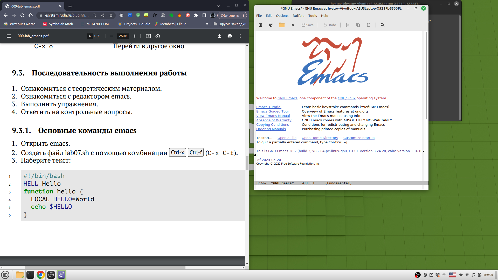
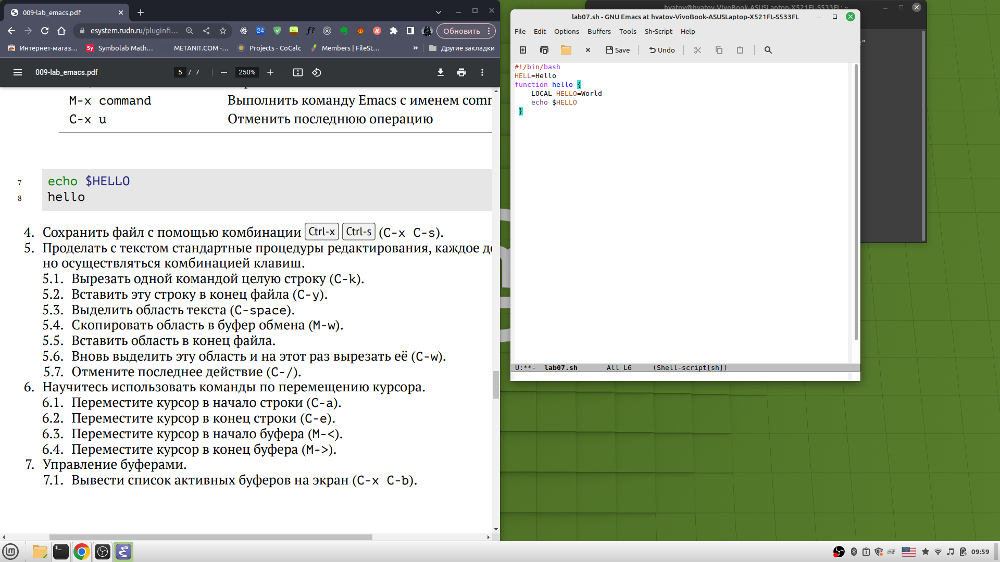
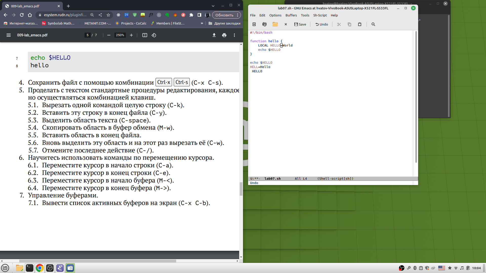
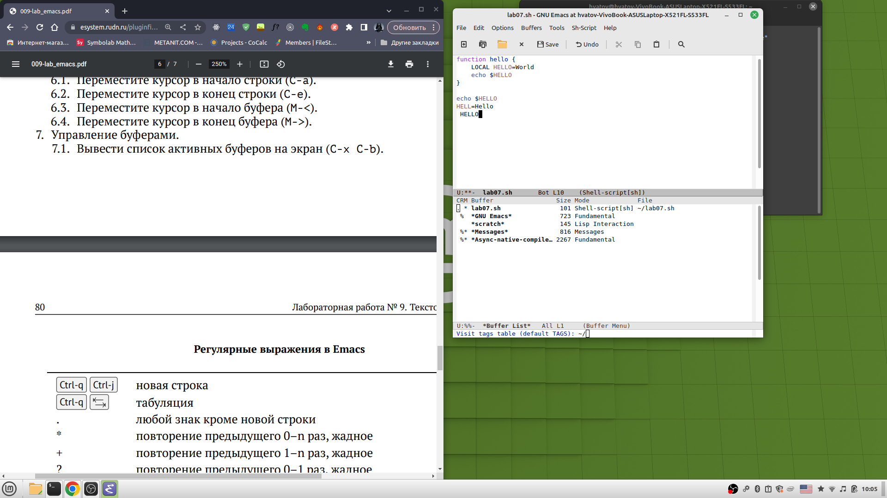
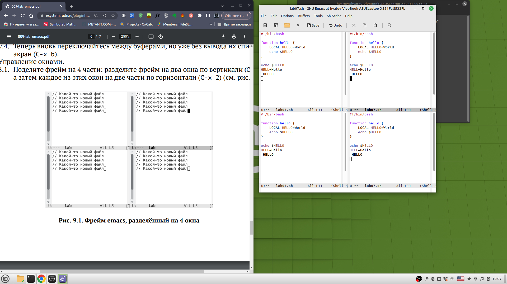
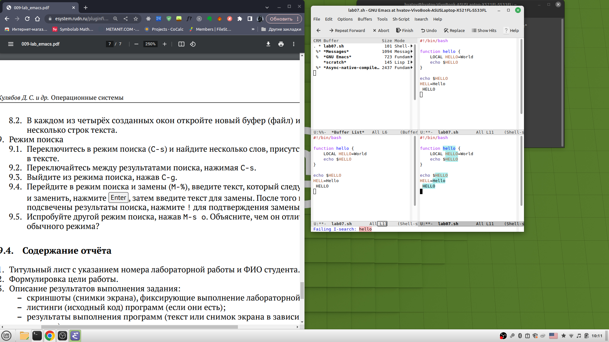

---
## Front matter
title: "Отчёт по лабораторной работе"
subtitle: "Лабораторная работа №9"
author: "Хватов Максим Григорьевич"

## Generic otions
lang: ru-RU
toc-title: "Содержание"

## Bibliography
bibliography: bib/cite.bib
csl: pandoc/csl/gost-r-7-0-5-2008-numeric.csl

## Pdf output format
toc: true # Table of contents
toc-depth: 2
lof: true # List of figures
lot: true # List of tables
fontsize: 12pt
linestretch: 1.5
papersize: a4
documentclass: scrreprt
## I18n polyglossia
polyglossia-lang:
  name: russian
  options:
	- spelling=modern
	- babelshorthands=true
polyglossia-otherlangs:
  name: english
## I18n babel
babel-lang: russian
babel-otherlangs: english
## Fonts
mainfont: PT Serif
romanfont: PT Serif
sansfont: PT Sans
monofont: PT Mono
mainfontoptions: Ligatures=TeX
romanfontoptions: Ligatures=TeX
sansfontoptions: Ligatures=TeX,Scale=MatchLowercase
monofontoptions: Scale=MatchLowercase,Scale=0.9
## Biblatex
biblatex: true
biblio-style: "gost-numeric"
biblatexoptions:
  - parentracker=true
  - backend=biber
  - hyperref=auto
  - language=auto
  - autolang=other*
  - citestyle=gost-numeric
## Pandoc-crossref LaTeX customization
figureTitle: "Рис."
tableTitle: "Таблица"
listingTitle: "Листинг"
lofTitle: "Список иллюстраций"
lotTitle: "Список таблиц"
lolTitle: "Листинги"
## Misc options
indent: true
header-includes:
  - \usepackage{indentfirst}
  - \usepackage{float} # keep figures where there are in the text
  - \floatplacement{figure}{H} # keep figures where there are in the text
---

# Цель работы

Познакомиться с операционной системой Linux. Получить практические навыки работы с редактором Emacs.

# Задание

1. Ознакомиться с теоретическим материалом.
2. Ознакомиться с редактором emacs.
3. Выполнить упражнения.
4. Ответить на контрольные вопросы.

# Теоретическое введение

## Основные термины Emacs

*Определение 1.* Буфер — объект, представляющий какой-либо текст.
Буфер может содержать что угодно, например, результаты компиляции программы
или встроенные подсказки. Практически всё взаимодействие с пользователем, в том
числе интерактивное, происходит посредством буферов.

*Определение 2.* Фрейм соответствует окну в обычном понимании этого слова. Каждый
фрейм содержит область вывода и одно или несколько окон Emacs.

*Определение 3.* Окно — прямоугольная область фрейма, отображающая один из буферов.
Каждое окно имеет свою строку состояния, в которой выводится следующая информация: название буфера, его основной режим, изменялся ли текст буфера и как далеко вниз
по буферу расположен курсор. Каждый буфер находится только в одном из возможных
основных режимов. Существующие основные режимы включают режим Fundamental
(наименее специализированный), режим Text, режим Lisp, режим С, режим Texinfo
и другие. Под второстепенными режимами понимается список режимов, которые включены в данный момент в буфере выбранного окна.

*Определение 4.* Область вывода — одна или несколько строк внизу фрейма, в которой
Emacs выводит различные сообщения, а также запрашивает подтверждения и дополнительную информацию от пользователя.

*Определение 5.* Минибуфер используется для ввода дополнительной информации и всегда отображается в области вывода.

*Определение 6.* Точка вставки — место вставки (удаления) данных в буфере.

# Выполнение лабораторной работы

Запускаю редактор emacs через терминал, используя команду emacs

{#fig:001 width=70%}

Создаю файл с помощью комбинации C-x C-f и называю его lab07.sh и ввожу в него код из листинга

{#fig:001 width=70%}

Сохраняю файл с помощью комбинации C-x C-s
Проделываю редактирование текста с помощью комбинаций клавиш для перемещения, выделения, вырезания, и те же самые действия, но для областей.

{#fig:001 width=70%}

Использовал перемещение курсора в  начало строки C-a
Переместил курсор в конец строки C-e
Перееместил курсор в начало буфера Alt+>
Переместил курсор в конец буфера Alt+<

Вывел список активных буферов на экран с помощью комбинаций C-x C-b
Переключился между буферами.

{#fig:001 width=70%}

Разделил окна на 2, а затем и на 4 части с помощью комбинаций C-x 3 и C-x 2

{#fig:001 width=70%}

Осуществил поиск по слову hello. Также можно осуществить поиск через регулярные выражения, используя команду Alt+s

{#fig:001 width=70%}

# Выводы

Я получил практические навыки по работе с редактором emacs в системе Linux.

# Ответы на контрольные вопросы

1. Emacs представляет собой мощный экранный редактор текста, написанный на языке
высокого уровня Elisp.
2. Взаимодействие с помощью горячих клавиш
3. Буфер представляет собой текст, а окно- это область экрана, в которой мы что-либо вводим
4. Можно
5. Буфер с именем *.scratch
6. Ctrl+C, Ctrl+C c
7. C-x 2
8. В файле .emacs
9. Удаляет текст
10. Emacs, т.к. в нем удобнее перемещать по редактору с помщью стрелок и выглядит всё намного логичнее.

# Список литературы{.unnumbered}

::: {#refs}
:::
