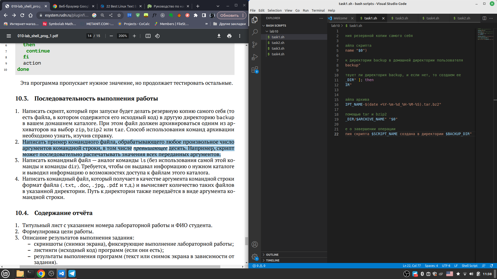
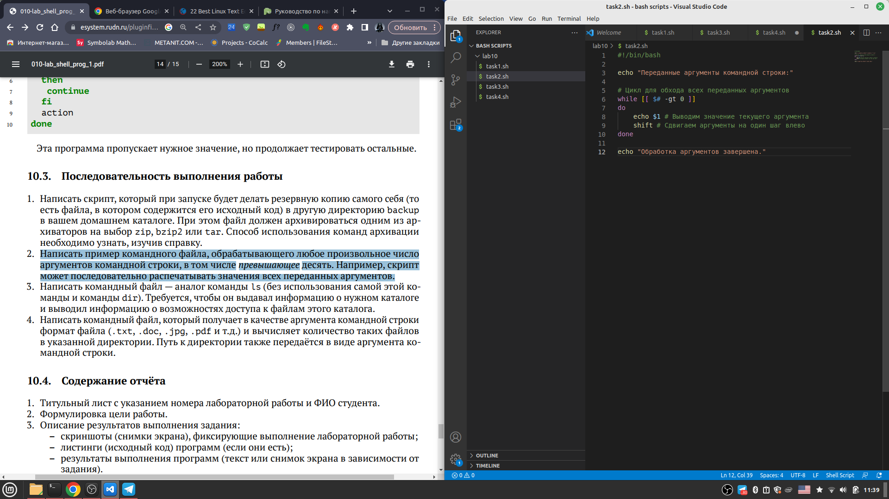
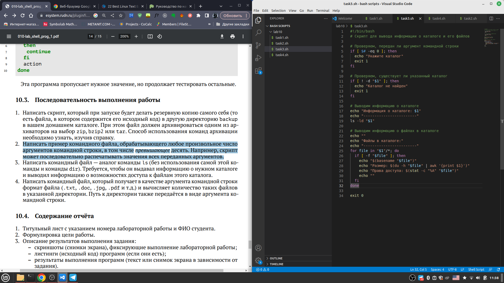
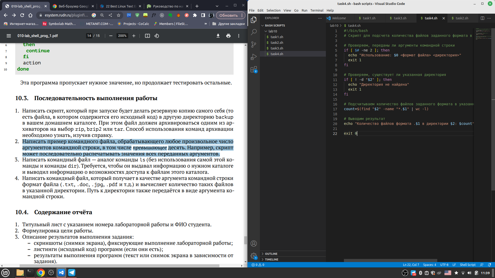

---
## Front matter
title: "Отчёт по лабораторной работе"
subtitle: "Лабораторная работа №10"
author: "Хватов Максим Григорьевич"

## Generic otions
lang: ru-RU
toc-title: "Содержание"

## Bibliography
bibliography: bib/cite.bib
csl: pandoc/csl/gost-r-7-0-5-2008-numeric.csl

## Pdf output format
toc: true # Table of contents
toc-depth: 2
lof: true # List of figures
lot: true # List of tables
fontsize: 12pt
linestretch: 1.5
papersize: a4
documentclass: scrreprt
## I18n polyglossia
polyglossia-lang:
  name: russian
  options:
	- spelling=modern
	- babelshorthands=true
polyglossia-otherlangs:
  name: english
## I18n babel
babel-lang: russian
babel-otherlangs: english
## Fonts
mainfont: PT Serif
romanfont: PT Serif
sansfont: PT Sans
monofont: PT Mono
mainfontoptions: Ligatures=TeX
romanfontoptions: Ligatures=TeX
sansfontoptions: Ligatures=TeX,Scale=MatchLowercase
monofontoptions: Scale=MatchLowercase,Scale=0.9
## Biblatex
biblatex: true
biblio-style: "gost-numeric"
biblatexoptions:
  - parentracker=true
  - backend=biber
  - hyperref=auto
  - language=auto
  - autolang=other*
  - citestyle=gost-numeric
## Pandoc-crossref LaTeX customization
figureTitle: "Рис."
tableTitle: "Таблица"
listingTitle: "Листинг"
lofTitle: "Список иллюстраций"
lotTitle: "Список таблиц"
lolTitle: "Листинги"
## Misc options
indent: true
header-includes:
  - \usepackage{indentfirst}
  - \usepackage{float} # keep figures where there are in the text
  - \floatplacement{figure}{H} # keep figures where there are in the text
---

# Цель работы

Изучить основы программирования в оболочке ОС UNIX/Linux. Научиться писать
небольшие командные файлы.

# Задание

1. Написать скрипт, который при запуске будет делать резервную копию самого себя (то
есть файла, в котором содержится его исходный код) в другую директорию backup
в вашем домашнем каталоге. При этом файл должен архивироваться одним из архиваторов на выбор zip, bzip2 или tar. Способ использования команд архивации
необходимо узнать, изучив справку.
2. Написать пример командного файла, обрабатывающего любое произвольное число
аргументов командной строки, в том числе превышающее десять. Например, скрипт
может последовательно распечатывать значения всех переданных аргументов.
3. Написать командный файл — аналог команды ls (без использования самой этой команды и команды dir). Требуется, чтобы он выдавал информацию о нужном каталоге
и выводил информацию о возможностях доступа к файлам этого каталога.
4. Написать командный файл, который получает в качестве аргумента командной строки
формат файла (.txt, .doc, .jpg, .pdf и т.д.) и вычисляет количество таких файлов
в указанной директории. Путь к директории также передаётся в виде аргумента командной строки.

# Теоретическое введение

Командный процессор (командная оболочка, интерпретатор команд shell) — это программа, позволяющая пользователю взаимодействовать с операционной системой
компьютера. В операционных системах типа UNIX/Linux наиболее часто используются
следующие реализации командных оболочек:
– оболочка Борна (Bourne shell или sh) — стандартная командная оболочка UNIX/Linux,
содержащая базовый, но при этом полный набор функций;
– С-оболочка (или csh) — надстройка на оболочкой Борна, использующая С-подобный
синтаксис команд с возможностью сохранения истории выполнения команд;
– оболочка Корна (или ksh) — напоминает оболочку С, но операторы управления программой совместимы с операторами оболочки Борна;
– BASH — сокращение от Bourne Again Shell (опять оболочка Борна), в основе своей совмещает свойства оболочек С и Корна (разработка компании Free Software Foundation).
POSIX (Portable Operating System Interface for Computer Environments) — набор стандартов
описания интерфейсов взаимодействия операционной системы и прикладных программ.
Стандарты POSIX разработаны комитетом IEEE (Institute of Electrical and Electronics
Engineers) для обеспечения совместимости различных UNIX/Linux-подобных операционных систем и переносимости прикладных программ на уровне исходного кода.
POSIX-совместимые оболочки разработаны на базе оболочки Корна.
Рассмотрим основные элементы программирования в оболочке bash. В других оболочках большинство команд будет совпадать с описанными ниже

# Выполнение лабораторной работы

1. Задание 1. Пишем код
{#fig:001 width=70%}

2. Задание 2. Пишем код
{#fig:001 width=70%}

3. Задание 3. Пишем код
{#fig:001 width=70%}

4. Задание 4. Пишем код
{#fig:001 width=70%}

# Выводы

Я научился писать небольшие команды на языке Bash в среде Linux

# Ответы на контрольные вопросы

1. Bash — самая распространённая оболочка под Linux. Она ведёт историю команд и предоставляет возможность их редактирования;

pdksh — клон korn shell, хорошо известной оболочки в системах UNIX;

tcsh — улучшенная версия >C shell;

zsh — новейшая из перечисленных здесь оболочек; реализует улучшенное дополнение и другие удобные функции.

Оболочкой по умолчанию является Bash (Bourne Again Shell).
2. POSIX (англ. Portable Operating System Interface — переносимый интерфейс операционных систем) — набор стандартов, описывающих интерфейсы между операционной системой и прикладной программой (системный API), библиотеку языка C и набор приложений и их интерфейсов. Стандарт создан для обеспечения совместимости различных UNIX-подобных операционных систем и переносимости прикладных программ на уровне исходного кода, но может быть использован и для не-Unix систем.
3.   arr=(Hello World) NAME=value
4.  в bash оператор let используется для назначения значения переменной. Этот оператор позволяет выполнить арифметическое выражение и сохранить результат в переменной. Например, let x=5+3 установит значение переменной x равным 8.

Оператор read используется для чтения данных из стандартного ввода и сохранения в переменной. Этот оператор часто используется для взаимодействия с пользователем через терминал. Команда read ждет ввода данных от пользователя и сохраняет их в переменной. Например, read name позволит пользователю ввести свое имя, а затем сохранит его в переменной name.
5. Сложение, вычитание, умножение, деление
6. Операция (( )) в синтаксисе языка bash используется для выполнения арифметических вычислений. Она позволяет использовать значения переменных в математических выражениях, а также выполнять различные операции, такие как сложение, вычитание, умножение и деление. При этом скобки (( )) обозначают начало и конец выражения, а внутри них указываются операторы и операнды, разделенные пробелами.
7. переменные окружения: PATH, HOME, LANG, SHELL, USER, и т.д.
8. Метасимволы в bash - это символы, которые имеют специальное значение при использовании в командной строке. Например, символ звездочки ( * ) является метасимволом, который обозначает любую последовательность символов. Символы $ и # также являются метасимволами, используемыми в bash для обращения к переменным. Метасимволы позволяют значительно ускорить работу с командной строкой и сделать ее более эффективной.
9.  используется символ обратной косой черты
10. Написать код в текстовом редакторе и запустить в терминале с помощью команды bash
11.  в языке программирования Bash объявляются с использованием ключевого слова `function`, за которым следует имя функции и открывающая скобка. Тело функции заключается в фигурные скобки `{}`.
12. Выполнить команду test -d filename
13. Команда set в bash используется для вывода списка всех текущих переменных, функций и настроек оболочки. Также она используется для задания новых переменных и настроек, например, установки режима работы скрипта.

Команда typeset позволяет задать определенные атрибуты переменной, такие как тип данных, область видимости, флаги только для чтения и другие атрибуты.

Команда unset используется для удаления переменной, функции или настройки оболочки из среды выполнения bash. Это может быть полезно, когда переменная больше не нужна или когда необходимо очистить память.
14. Аргументы передаются в командный файл путем разделения их пробелами в командной строке и передачи их как параметров команды. Внутри скрипта параметры доступны через переменные, начинающиеся с символа $. 
15. 1. $$ - переменная, которая содержит идентификатор текущего процесса.2. $0 - переменная, которая содержит имя выполняемого скрипта.3. $1, $2, $3 и т.д. - переменные, которые содержат аргументы переданные в скрипт.4. $@ - переменная, которая содержит все аргументы переданные в скрипт, каждый аргумент отделен от другого пробелом.5. $# - переменная, которая содержит количество аргументов переданных в скрипт.6. $USER - переменная, которая содержит имя текущего пользователя.7. $HOME - переменная, которая содержит домашний каталог текущего пользователя.8. $PWD - переменная, которая содержит текущий рабочий каталог.

# Список литературы{.unnumbered}

::: {#refs}
:::
