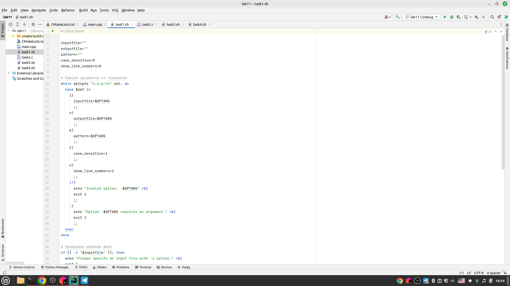
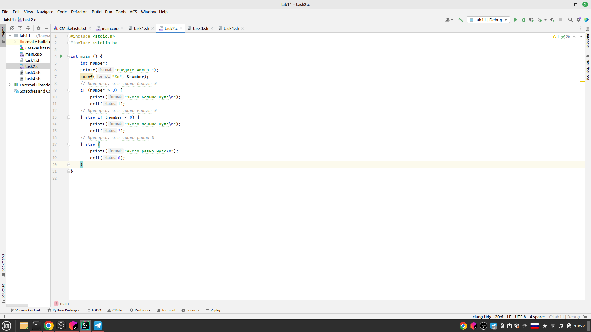
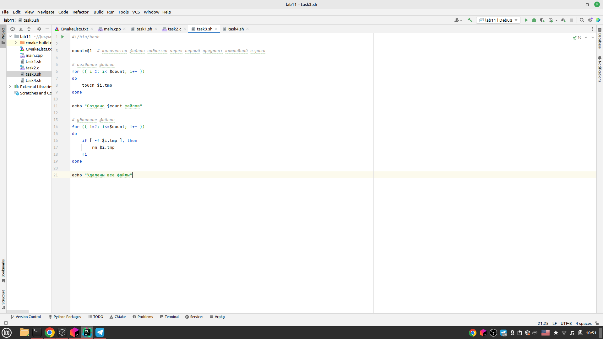
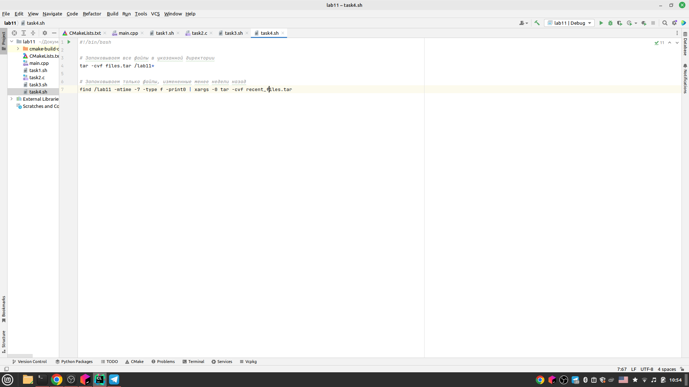

---
## Front matter
title: "Отчёт по лабораторной работе"
subtitle: "Лабораторная работа №11"
author: "Хватов Максим Григорьевич"

## Generic otions
lang: ru-RU
toc-title: "Содержание"

## Bibliography
bibliography: bib/cite.bib
csl: pandoc/csl/gost-r-7-0-5-2008-numeric.csl

## Pdf output format
toc: true # Table of contents
toc-depth: 2
lof: true # List of figures
lot: true # List of tables
fontsize: 12pt
linestretch: 1.5
papersize: a4
documentclass: scrreprt
## I18n polyglossia
polyglossia-lang:
  name: russian
  options:
	- spelling=modern
	- babelshorthands=true
polyglossia-otherlangs:
  name: english
## I18n babel
babel-lang: russian
babel-otherlangs: english
## Fonts
mainfont: PT Serif
romanfont: PT Serif
sansfont: PT Sans
monofont: PT Mono
mainfontoptions: Ligatures=TeX
romanfontoptions: Ligatures=TeX
sansfontoptions: Ligatures=TeX,Scale=MatchLowercase
monofontoptions: Scale=MatchLowercase,Scale=0.9
## Biblatex
biblatex: true
biblio-style: "gost-numeric"
biblatexoptions:
  - parentracker=true
  - backend=biber
  - hyperref=auto
  - language=auto
  - autolang=other*
  - citestyle=gost-numeric
## Pandoc-crossref LaTeX customization
figureTitle: "Рис."
tableTitle: "Таблица"
listingTitle: "Листинг"
lofTitle: "Список иллюстраций"
lotTitle: "Список таблиц"
lolTitle: "Листинги"
## Misc options
indent: true
header-includes:
  - \usepackage{indentfirst}
  - \usepackage{float} # keep figures where there are in the text
  - \floatplacement{figure}{H} # keep figures where there are in the text
---

# Цель работы

Изучить основы программирования в оболочке ОС UNIX. Научится писать более
сложные командные файлы с использованием логических управляющих конструкций
и циклов.

# Задание

1. Используя команды getopts grep, написать командный файл, который анализирует
командную строку с ключами:
– -iinputfile — прочитать данные из указанного файла;
– -ooutputfile — вывести данные в указанный файл;
– -pшаблон — указать шаблон для поиска;
– -C — различать большие и малые буквы;
– -n — выдавать номера строк.
а затем ищет в указанном файле нужные строки, определяемые ключом -p.
2. Написать на языке Си программу, которая вводит число и определяет, является ли оно
больше нуля, меньше нуля или равно нулю. Затем программа завершается с помощью
функции exit(n), передавая информацию в о коде завершения в оболочку. Командный файл должен вызывать эту программу и, проанализировав с помощью команды
$?, выдать сообщение о том, какое число было введено.
3. Написать командный файл, создающий указанное число файлов, пронумерованных
последовательно от 1 до 𝑁 (например 1.tmp, 2.tmp, 3.tmp,4.tmp и т.д.). Число файлов,
которые необходимо создать, передаётся в аргументы командной строки. Этот же командный файл должен уметь удалять все созданные им файлы (если они существуют).
4. Написать командный файл, который с помощью команды tar запаковывает в архив
все файлы в указанной директории. Модифицировать его так, чтобы запаковывались
только те файлы, которые были изменены менее недели тому назад (использовать
команду find).

# Теоретическое введение

## Оператор цикла for
В обобщённой форме оператор цикла for выглядит следующим образом:
```
for имя [in список-значений]
    do список-команд
done
```

При каждом следующем выполнении оператора цикла for переменная имя принимает следующее значение из списка значений, задаваемых списком список -значений.
Вообще говоря, список-значений является необязательным. При его отсутствии оператор
цикла for выполняется для всех позиционных параметров или, иначе говоря, аргументов. Таким образом, оператор for i эквивалентен оператору for i in $*. Выполнение
оператора цикла for завершается, когда список-значений будет исчерпан. Последовательность команд (операторов), задаваемая списком список-команд, состоит из одной или
более команд оболочки, отделённых друг от друга с помощью символов newline или ;.

## Условный оператор if
В обобщённой форме условный оператор if выглядит следующим образом:
```
if список-команд
then список-команд
{elif список-команд
then список-команд}
[else список-команд]
fi
```
Выполнение условного оператора if сводится к тому, что сначала выполняется последовательность команд (операторов), которую задаёт список-команд в строке, содержащей
служебное слово if. Затем, если последняя выполненная команда из этой последовательности команд возвращает нулевой код завершения (истина), то будет выполнена
последовательность команд (операторов), которую задаёт список-команд в строке, содержащей служебное слово then. Фраза elif проверяется в том случае, когда предыдущая
проверка была ложной. Строка, содержащая служебное слово else, является необязательной. Если она присутствует, то последовательность команд (операторов), которую задаёт
список-команд в строке, содержащей служебное слово else, будет выполнена только при
условии, что последняя выполненная команда из последовательности команд (операторов), которую задаёт список-команд в строке, содержащей служебное слово if или elif,
возвращает ненулевой код завершения (ложь).

## Оператор выбора case
Оператор выбора case реализует возможность ветвления на произвольное число
ветвей. Эта возможность обеспечивается в большинстве современных языков программирования, предполагающих использование структурного подхода.
В обобщённой форме оператор выбора case выглядит следующим образом:

```
case имя in
шаблон1) список-команд;;
шаблон2) список-команд;;
...
 esac

```
Выполнение оператора выбора case сводится к тому, что выполняется последовательность команд (операторов), задаваемая списком список-команд, в строке, для которой
значение переменной имя совпадает с шаблоном. Поскольку метасимвол * соответствует произвольной, в том числе и пустой, последовательности символов, то его можно
использовать в качестве шаблона в последней строке перед служебным словом esac.
В этом случае реализуются все действия, которые необходимо произвести, если значение
переменной имя не совпадает ни с одним из шаблонов, заданных в предшествующих
строках


# Выполнение лабораторной работы

1. Скрипт проверяет правильность имени файла и его наличие в файловой системе 

   {#fig:001 width=70%}
   
2. {#fig:001 width=70%}

3. Здесь нужно выполнить цикл от 1 до n, чтобы создать файлы и проделать тоже самое, но уже учитывая названия файлов, чтобы удалить их 
{#fig:001 width=70%}
4. Упаковываем файлы в той же директории, где и был запущен скрипт
{#fig:001 width=70%}


# Выводы

Я научился писать более сложные логические конструкции и циклы в Linux.

# Ответы на контрольные вопросы

1. Команда getopts в Unix/Linux используется для разбора аргументов командной строки. Она позволяет программистам написать скрипты, которые могут принимать параметры от пользователя и выполнять соответствующие операции в соответствии с ними. 
2. Метасимволы являются частью механизма генерации имён файлов в операционных системах. Они используются для поиска и выборки файлов в соответствии с определенными шаблонами имён файлов.
3. Операторы case, for, while и операторы направления ввода-вывода
4. break continue
5. Для обозначения истинности и ложности логических выражений
6. Строка проверяет существование файла `man$s/$i.$s`, который определен с помощью переменных. Если файл существует, то условие истинно и выполняется соответствующая команда в блоке "then".
7. Различие между `while` и `until` состоит только в том, каким образом проверяется условие выхода из цикла. Если условие зависит от того, когда оно станет истинным, используйте `while`. Если условие зависит от того, когда оно станет ложным, используйте `until`.

# Список литературы{.unnumbered}

::: {#refs}
:::
