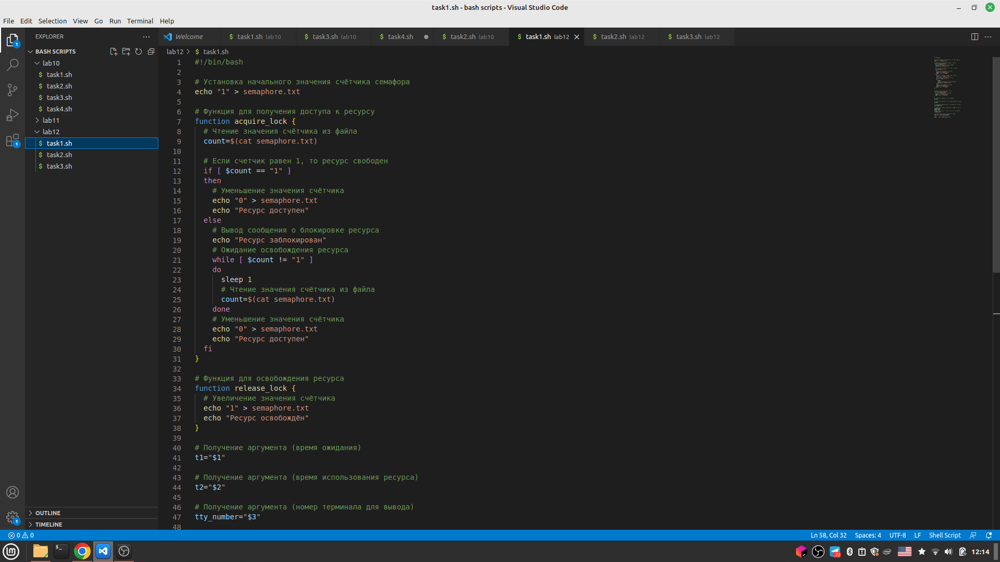
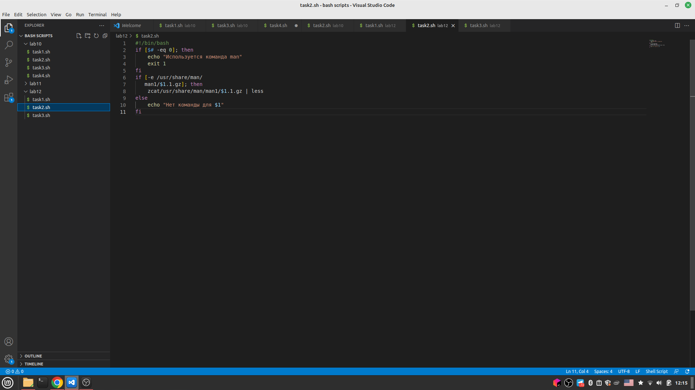
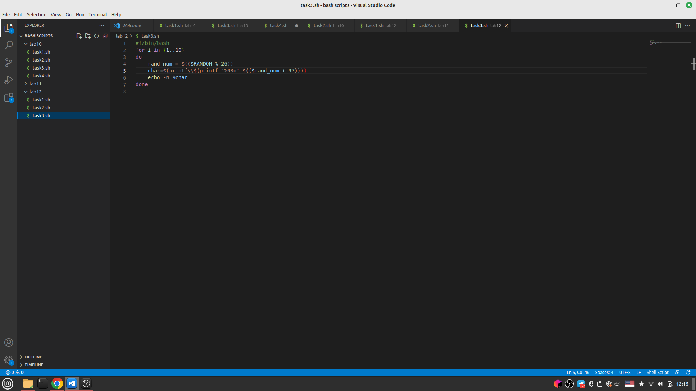

---
## Front matter
title: "Отчёт по лабораторной работе"
subtitle: "Лабораторная работа №12"
author: "Хватов Максим Григорьевич"

## Generic otions
lang: ru-RU
toc-title: "Содержание"

## Bibliography
bibliography: bib/cite.bib
csl: pandoc/csl/gost-r-7-0-5-2008-numeric.csl

## Pdf output format
toc: true # Table of contents
toc-depth: 2
lof: true # List of figures
lot: true # List of tables
fontsize: 12pt
linestretch: 1.5
papersize: a4
documentclass: scrreprt
## I18n polyglossia
polyglossia-lang:
  name: russian
  options:
	- spelling=modern
	- babelshorthands=true
polyglossia-otherlangs:
  name: english
## I18n babel
babel-lang: russian
babel-otherlangs: english
## Fonts
mainfont: PT Serif
romanfont: PT Serif
sansfont: PT Sans
monofont: PT Mono
mainfontoptions: Ligatures=TeX
romanfontoptions: Ligatures=TeX
sansfontoptions: Ligatures=TeX,Scale=MatchLowercase
monofontoptions: Scale=MatchLowercase,Scale=0.9
## Biblatex
biblatex: true
biblio-style: "gost-numeric"
biblatexoptions:
  - parentracker=true
  - backend=biber
  - hyperref=auto
  - language=auto
  - autolang=other*
  - citestyle=gost-numeric
## Pandoc-crossref LaTeX customization
figureTitle: "Рис."
tableTitle: "Таблица"
listingTitle: "Листинг"
lofTitle: "Список иллюстраций"
lotTitle: "Список таблиц"
lolTitle: "Листинги"
## Misc options
indent: true
header-includes:
  - \usepackage{indentfirst}
  - \usepackage{float} # keep figures where there are in the text
  - \floatplacement{figure}{H} # keep figures where there are in the text
---

# Цель работы

Изучить основы программирования в оболочке ОС UNIX. Научиться писать более
сложные командные файлы с использованием логических управляющих конструкций
и циклов

# Задание

1. Написать командный файл, реализующий упрощённый механизм семафоров. Командный файл должен в течение некоторого времени t1 дожидаться освобождения
ресурса, выдавая об этом сообщение, а дождавшись его освобождения, использовать
его в течение некоторого времени t2<>t1, также выдавая информацию о том, что
ресурс используется соответствующим командным файлом (процессом). Запустить
командный файл в одном виртуальном терминале в фоновом режиме, перенаправив
его вывод в другой (> /dev/tty#, где # — номер терминала куда перенаправляется
вывод), в котором также запущен этот файл, но не фоновом, а в привилегированном
режиме. Доработать программу так, чтобы имелась возможность взаимодействия трёх
и более процессов.
2. Реализовать команду man с помощью командного файла. Изучите содержимое каталога /usr/share/man/man1. В нем находятся архивы текстовых файлов, содержащих
справку по большинству установленных в системе программ и команд. Каждый архив
можно открыть командой less сразу же просмотрев содержимое справки. Командный
файл должен получать в виде аргумента командной строки название команды и в виде
результата выдавать справку об этой команде или сообщение об отсутствии справки,
если соответствующего файла нет в каталоге man1.
3. Используя встроенную переменную $RANDOM, напишите командный файл, генерирующий случайную последовательность букв латинского алфавита. Учтите, что $RANDOM
выдаёт псевдослучайные числа в диапазоне от 0 до 32767.

# Теоретическое введение

Вся необходимая теория была описана  в прошлых лабораторных работах, она касается циклов и условий.

# Выполнение лабораторной работы

1. Перва якоманда запускает скрипт в фоновом режиме с задержкой 5 секунд и временем использования 10 секунд. Вторая команда запускает скрипт в привилегированном режиме, перенаправляя вывод в терминал 2. После перенкаправления, в терминале 2 будет сообщение о том, что ресурс успешно использован. Комментарии к коду в листинге.

{#fig:001 width=70%}

2. Скрипт проверяет наличие архива справки для команды, указанной в аргументе командной строки. Если архив существует, то он распаковывается с помощью команды zcat и выводится с помощью less. Если архив не найден, то выводится сообщение об отсутствии справки. 

{#fig:001 width=70%}

3. В этом скрипте мы используем цикл for, чтобы сгенерировать последовательность из 10 букв латинского алфавита. Для каждого шага мы генерируем случайное число от 0 до 25. Затем мы преобразуем это число в соответсвующий символ латинского алфавита. И затем просто выводим этот символ. Код в листинге

{#fig:001 width=70%}


# Выводы

Я научился писать более сложные конструкции с помощью циклов и условынх операторов в Linux.

# Ответы на контрольные вопросы

1. Синтаксическая ошибка в этой строке кода заключается в том, что в квадратных скобках должен быть используется знак равенства == вместо неравенства !=. Кроме того, скобки являются частью команды test, так что их необходимо оставить внутри обратных кавычек или двойных круглых скобок. 
2. Вы можете использовать оператор ">>", чтобы добавить содержимое одной строки к другой строке. Например, вот как объединить строки "Hello " и "World!" в одну строку:

```bash
text="Hello "
text+="World!"
echo $text # выводит "Hello World!"
```
3.  Использование синтаксиса фигурных скобок:

   ```
   $ echo {1..10}
   1 2 3 4 5 6 7 8 9 10
   ```

   Использование цикла `for`:

   ```
   $ for i in {1..10}; do echo $i; done
   1
   2
   3
   4
   5
   6
   7
   8
   9
   10
   ```

По сравнению с утилитой seq, эти способы могут быть более гибкими и позволяют создавать последовательности с более сложной логикой, например, с заданным шагом или с использованием других условий. Однако, утилита seq имеет простой и удобный синтаксис для создания простых последовательностей чисел.

4. 3,3333333333
5. Автодополнение в zsh работает более интеллектуально, позволяя просматривать и выбирать варианты рекурсивно.

В zsh есть более мощная поддержка плагинов и дополнений, таких как oh-my-zsh, что облегчает настройку и добавление функциональности.

В zsh есть более мощные возможности для работы с массивами, хэш-таблицами и переменными окружения.

В zsh есть встроенная поддержка расширенных шаблонов и условный оператор, позволяющий выполнять более сложные операции с файлами и директориями.

Значительное преимущество zsh заключается в более типизированном и безопасном программировании (например, строгая проверка типов и зарезервированные слова).

6. Верен
7. Преимущества языка bash:

Bash легче и быстрее в освоении, чем полноценные языки программирования, такие как Python или Perl.

Bash может использоваться для быстрого выполнения задач командной строки, таких как системное администрирование, обработка текста и сканирование файловой системы и т.д.

Bash имеет интегрированные сценарии управления файлами, поддержку командной строки и утилиты для редактирования текста.

Недостатки языка bash:

Bash не является полноправным языком программирования и может иметь ограниченный функционал для более сложных задач.

Синтаксис bash могут привести к сложным ошибкам, если быть неосторожным при написании скриптов.

Bash чувствителен к различным окончаниям строк, что может привести к сбоев в работе скриптов, если строковые окончания не будут корректно настроены.

# Список литературы{.unnumbered}

::: {#refs}
:::
