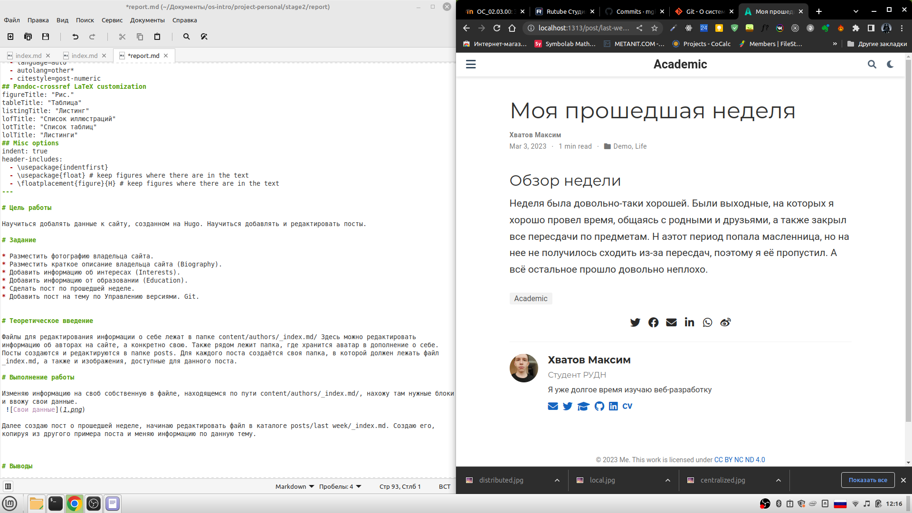

---
## Front matter
title: "Отчёт по второму этапу индивидуального проекта"
subtitle: "Добавление информации о себе"
author: "Хватов Максим Григорьевич"

## Generic otions
lang: ru-RU

## Bibliography
bibliography: bib/cite.bib
csl: pandoc/csl/gost-r-7-0-5-2008-numeric.csl

## Pdf output format
toc: true # Table of contents
toc-depth: 2
lof: true # List of figures
lot: true # List of tables
fontsize: 12pt
linestretch: 1.5
papersize: a4
documentclass: scrreprt
## I18n polyglossia
polyglossia-lang:
  name: russian
  options:
	- spelling=modern
	- babelshorthands=true
polyglossia-otherlangs:
  name: english
## I18n babel
babel-lang: russian
babel-otherlangs: english
## Fonts
mainfont: PT Serif
romanfont: PT Serif
sansfont: PT Sans
monofont: PT Mono
mainfontoptions: Ligatures=TeX
romanfontoptions: Ligatures=TeX
sansfontoptions: Ligatures=TeX,Scale=MatchLowercase
monofontoptions: Scale=MatchLowercase,Scale=0.9
## Biblatex
biblatex: true
biblio-style: "gost-numeric"
biblatexoptions:
  - parentracker=true
  - backend=biber
  - hyperref=auto
  - language=auto
  - autolang=other*
  - citestyle=gost-numeric
## Pandoc-crossref LaTeX customization
figureTitle: "Рис."
tableTitle: "Таблица"
listingTitle: "Листинг"
lofTitle: "Список иллюстраций"
lotTitle: "Список таблиц"
lolTitle: "Листинги"
## Misc options
indent: true
header-includes:
  - \usepackage{indentfirst}
  - \usepackage{float} # keep figures where there are in the text
  - \floatplacement{figure}{H} # keep figures where there are in the text
---

# Цель работы

Научиться добалять данные к сайту, созданном на Hugo. Научиться добавлять и редактировать посты.

# Задание

* Разместить фотографию владельца сайта.
* Разместить краткое описание владельца сайта (Biography).
* Добавить информацию об интересах (Interests).
* Добавить информацию от образовании (Education).
* Сделать пост по прошедшей неделе.
* Добавить пост на тему по Управлению версиями. Git.

# Теоретическое введение

Файлы для редактирования информации о себе лежат в папке content/authors/_index.md/ Здесь можно редактировать информацию об авторах на сайте, а конкретно свою. Также рядом лежит папка, где хранится аватар в дополнение о себе.
Посты создаются и редактируются в папке posts. Для каждого поста создаётся своя папка, в которой должен лежать файл _index.md, а также и изображения, доступные для данного поста.

# Выполнение работы

Изменяю информацию на своб собственную в файле, находящемся по пути content/authors/_index.md/, нахожу там нужные блоки и ввожу свои данные.
 

Далее создаю пост о прошедшей неделе, начинаю редактировать файл в каталоге posts/last week/_index.md. Создаю его, копируя из другого примера поста и меняю информацию по данную тему.
 

таким же способом создаю новый пост на тему контроля версий в Git. Создаю папку в директории posts/ с файлом _index.md, и добавляю туда информацию о статье вместе с изображениями.
 

# Выводы

Я научился добавлять данные к сайту, написанном с помощью Hugo. 
Научился добавлять и редактировать посты.
